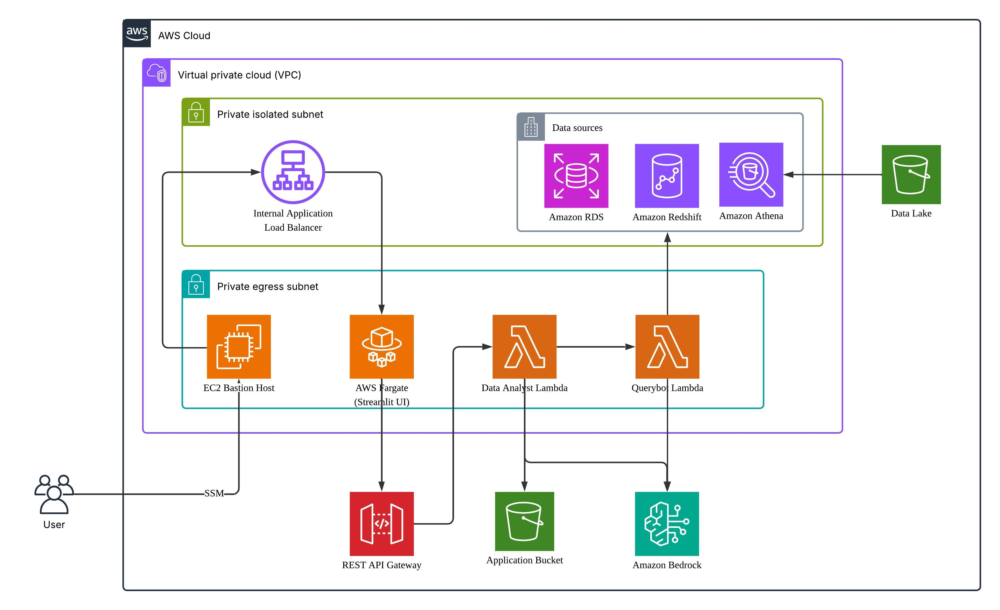

# Data Analyst Platform 🚀

A full-stack AWS data analysis platform with AI-powered SQL generation, featuring serverless backend processing and a secure Streamlit frontend interface.

## 🎯 Key Features

- **🤖 AI-Powered**: Bedrock integration for natural language to SQL conversion
- **⚡ Serverless Backend**: AWS Lambda functions for scalable data processing
- **📊 Streamlit Frontend**: Interactive web interface running on ECS Fargate
- **🗄️ Database**: PostgreSQL RDS for data storage and vector embeddings
- **🔐 Secure Access**: Bastion host with SSM Session Manager (no public IPs)
- **📋 Monitoring**: CloudWatch logs for all components

## 🏗️ Architecture



### Backend (Serverless)
- **data-analyst Lambda**: Main orchestrator, handles requests and responses
- **querybot Lambda**: Specialized SQL generation using few-shot learning
- **Custom Layers**: Dependencies (pandas, psycopg2, s3fs, openpyxl)
- **API Gateway**: RESTful API with API key authentication

### Frontend (Container-based)
- **Streamlit Application**: Interactive web interface on ECS Fargate
- **Internal ALB**: Application Load Balancer (private, no internet access)
- **Auto-scaling**: CPU/memory-based scaling (1-5 tasks)

### Security & Access
- **EC2 Bastion Host**: Secure access via SSM Session Manager
- **No Public IPs**: All components in private subnets
- **VPC Architecture**: Private subnets with egress and isolated subnets
- **IAM Roles**: Least privilege access for all components

## ⚡ Get Started
### Prerequisites

> [!IMPORTANT]
> Ensure all prerequisites are met before proceeding with deployment.

#### Required Software
- **Python 3.10+**: [Download](https://www.python.org/downloads/) | Check: `python --version`
- **AWS CLI v2.x**: [Install Guide](https://docs.aws.amazon.com/cli/latest/userguide/getting-started-install.html) | Check: `aws --version`
- **Node.js 16+**: [Download](https://nodejs.org/en/download/) | Check: `node --version`
- **AWS CDK CLI v2.x**: Install: `npm install -g aws-cdk` | Check: `cdk --version`
- **Docker**: [Install Guide](https://docs.docker.com/get-docker/) | Check: `docker --version`

#### AWS Account Requirements
- **AWS Account**: With programmatic access enabled
- **AWS Region**: Must support Bedrock, ECS, Lambda, RDS (recommend us-east-1 or us-west-2)
- **Existing VPC**: Must have properly configured subnets (details in step 1)
- **Metadata S3 Bucket**: Must pre-exist if using S3-Athena configurations

### Step 1: Verify Infrastructure Prerequisites

**Required Infrastructure:**
- **VPC**: Existing VPC with proper DNS resolution enabled
- **2 Private Egress Subnets**: With NAT Gateway access (for Lambda/ECS)
- **2 Private Isolated Subnets**: Without internet access (for RDS)
- **1 Security Group**: With required rules (see below)
- **Different Availability Zones**: All subnets must span multiple AZs

#### Security Group Configuration

**Inbound Rules:**
- `HTTP (80)` ← VPC CIDR: ALB to ECS communication
- `HTTPS (443)` ← VPC CIDR: Secure web traffic
- `PostgreSQL (5432)` ← VPC CIDR: Database access
- `SSH (22)` ← VPC CIDR: Bastion host access
- `Custom TCP (8501)` ← VPC CIDR: Streamlit application
- `All Traffic` ← Self-reference: Inter-service communication

**Outbound Rules:**
- `HTTPS (443)` → 0.0.0.0/0: AWS API calls and Bedrock
- `HTTP (80)` → 0.0.0.0/0: Package downloads
- `PostgreSQL (5432)` → VPC CIDR: Database connections
- `DNS (53 UDP/TCP)` → 0.0.0.0/0: Name resolution
- `All Traffic` → Self-reference: Inter-service communication

### Step 2: Configure AWS CLI & Permissions

#### Set Up AWS Profile
```bash
# Configure a dedicated profile
aws configure --profile data-analyst

# Set environment variable for all subsequent commands
export AWS_PROFILE=data-analyst

# Verify configuration
aws sts get-caller-identity
```

#### Required Permissions

> [!TIP]
> For development environments, use AWS managed policies. For production, implement least-privilege policies.

**Development Quick Setup:**
```bash
# Attach these managed policies to your IAM user/role:
- PowerUserAccess
- IAMFullAccess  
- CloudWatchLogsFullAccess
```

**Core Services Required:**
- **Infrastructure**: CloudFormation, IAM, VPC/EC2, S3
- **Compute**: Lambda, ECS, Application Load Balancer
- **Database**: RDS, DynamoDB, Athena, Glue
- **AI/API**: Bedrock, API Gateway, Step Functions
- **Monitoring**: CloudWatch Logs, Systems Manager, EventBridge

<details>
<summary><b>Production Policy Example</b></summary>

```json
{
    "Version": "2012-10-17",
    "Statement": [
        {
            "Effect": "Allow",
            "Action": [
                "cloudformation:*",
                "iam:*",
                "ec2:*",
                "rds:*",
                "lambda:*",
                "ecs:*",
                "elasticloadbalancing:*",
                "s3:*",
                "dynamodb:*",
                "apigateway:*",
                "logs:*",
                "athena:*",
                "glue:*",
                "states:*",
                "ssm:*",
                "application-autoscaling:*",
                "bedrock:*",
                "events:*",
                "sts:GetCallerIdentity"
            ],
            "Resource": "*"
        }
    ]
}
```

</details>

#### Verify Access
```bash
# Test key service access
aws cloudformation list-stacks --region us-east-1
aws ec2 describe-vpcs --region us-east-1  
aws bedrock list-foundation-models --region us-east-1
```

### Step 3: Project Setup

#### Clone Repository
```bash
git clone <repository-url>
cd sample-data-analyst

# Install CDK dependencies
cd cdk && pip install -r requirements.txt && cd ..
```

### Step 4: Configuration

> [!IMPORTANT]
> - All REQUIRED fields must be provided
> - VPC and subnets must already exist
> - Metadata S3 bucket must pre-exist for S3 database types
> - Database credentials must be valid and accessible
> - Bedrock models must be enabled in your region

#### Edit Configuration File

Edit values in `cdk/cdk.json`:

#### Configuration Reference

**REQUIRED Core Infrastructure:**
- `project_name`: Base name for all AWS resources
- `vpc_id`: Existing VPC ID (REQUIRED)
- `private_egress_subnet_1/2`: Private subnets with NAT Gateway (REQUIRED)
- `private_isolated_subnet_1/2`: Private isolated subnets for RDS (REQUIRED)
- `security_group_id`: Security group with proper rules (REQUIRED)

**REQUIRED Database Configuration:**
- `db_username`: PostgreSQL master username (REQUIRED)
- `db_name`: PostgreSQL database name (REQUIRED)  
- `db_password`: PostgreSQL master password (REQUIRED)
- `api_db_host`: External database hostname (REQUIRED)
- `api_db_port`: External database port (REQUIRED)
- `api_db_name`: External database name (REQUIRED)
- `api_db_user`: External database username (REQUIRED)
- `api_db_password`: External database password (REQUIRED)
- `api_db_type`: Database type - `postgresql`, `redshift`, or `s3` (REQUIRED)

**OPTIONAL Configuration:**
- `sql_model_id`: Bedrock model for SQL generation
- `chat_model_id`: Bedrock model for chat responses  
- `embedding_model_id`: Bedrock model for vector embeddings
- `approach`: Examples selection method (`few_shot` or `zero_shot`)
- `metadata_s3_bucket`: S3 bucket for metadata (must pre-exist)
- `metadata_is_meta`: Enable metadata-driven schema discovery
- `metadata_table_meta`: S3 key for table metadata Excel file
- `metadata_column_meta`: S3 key for column metadata Excel file

#### Validate Configuration
```bash
# Verify VPC exists
aws ec2 describe-vpcs --vpc-ids $(grep vpc_id cdk/cdk.json | cut -d'"' -f4)

# Check Bedrock model access
aws bedrock list-foundation-models --region us-east-1 | grep -E "(claude-3|cohere)"
```

### Step 5: Deploy

> [!NOTE]
> Deployment typically takes 15-30 minutes. Monitor progress in the AWS CloudFormation console.

#### Deploy Infrastructure
```bash
# Deploy all stacks (this will take 15-30 minutes)
export AWS_PROFILE=data-analyst
./deploy.sh deploy
```

#### Verify Deployment
```bash
# Check stack status
export AWS_PROFILE=data-analyst
./deploy.sh status
```

### Step 6: Access the Application

#### Create Secure Tunnel
```bash
# Create SSH tunnel to bastion host (includes key setup)
./ssh_tunnel.sh

# The script will:
# 1. Create temporary EC2 Instance Connect key pair
# 2. Push public key to bastion host
# 3. Create SSH tunnel on port 8080
# 4. Display access instructions
```

#### Access Web Interface
```bash
# Open your browser to:
http://localhost:8080
```

### Step 7: Verify & Test

#### Test Data Analyst Functionality
1. **Access Streamlit Interface**: Verify the web interface loads properly
2. **Test Natural Language Query**: Try "Show me the first 10 rows from any table"
3. **Check Database Connection**: Verify connection to your configured database
4. **Monitor Logs**: Check CloudWatch logs for any errors

```bash
# View real-time logs
./view_logs.sh data-analyst
./view_logs.sh querybot
./view_logs.sh streamlit
```

## 🚨 Troubleshooting

> [!TIP]
> Most deployment issues are related to permissions or VPC configuration. Check these first.

<details>
<summary><b>Permission Denied Errors</b></summary>

**Symptoms**: CloudFormation deployment fails with permission errors

**Solutions**:
```bash
# Check your AWS identity
aws sts get-caller-identity

# Verify required permissions (see Step 2)
# Contact your AWS administrator if permissions are insufficient
```

</details>

<details>
<summary><b>VPC/Subnet Issues</b></summary>

**Symptoms**: Stack creation fails with subnet/VPC errors

**Solutions**:
```bash
# Verify VPC exists
aws ec2 describe-vpcs --vpc-ids your-vpc-id

# Check subnet configuration
aws ec2 describe-subnets --filters "Name=vpc-id,Values=your-vpc-id"

# Ensure subnets are in different AZs
aws ec2 describe-availability-zones --region your-region
```

</details>

<details>
<summary><b>Bedrock Model Access</b></summary>

**Symptoms**: Lambda functions fail with Bedrock access errors

**Solutions**:
> [!CAUTION]
> Bedrock models require explicit access approval in the AWS Console.

```bash
# Check model availability in your region
aws bedrock list-foundation-models --region your-region

# Enable Bedrock models in AWS Console:
# 1. Go to Amazon Bedrock console
# 2. Navigate to Model access
# 3. Request access to required models (Claude, Cohere)
```

</details>

<details>
<summary><b>Docker Issues</b></summary>

**Symptoms**: Layer building fails or ECS deployment issues

**Solutions**:
```bash
# Verify Docker is running
docker info

# For Mac users, ensure Docker Desktop is running
# For Linux users, start Docker service:
sudo systemctl start docker

# Test Docker with a simple command
docker run hello-world
```

</details>

## 🎯 Next Steps

After successful deployment:

1. **Configure Your Data Source**: Update database connection settings
2. **Upload Sample Data**: Use the S3-Athena flow for CSV data
3. **Test Query Examples**: Try various natural language queries
4. **Monitor Performance**: Check CloudWatch dashboards
5. **Customize Configuration**: Adjust AI models and parameters as needed

## 📊 Supported Database Types

> [!NOTE]
> The platform supports three database types. Choose the one that matches your data infrastructure.

### PostgreSQL
```json
{
  "api_db_host": "your-postgres-instance.region.rds.amazonaws.com",
  "api_db_port": 5432,
  "api_db_name": "your_database",
  "api_db_user": "your_user",
  "api_db_password": "your_password",
  "api_db_type": "postgresql"
}
```

### Redshift
```json
{
  "api_db_host": "your-redshift-cluster.region.redshift.amazonaws.com",
  "api_db_port": 5439,
  "api_db_name": "your_database",
  "api_db_user": "your_user",
  "api_db_password": "your_password",
  "api_db_type": "redshift"
}
```

### S3-Athena
```json
{
  "api_db_host": "",
  "api_db_port": 0,
  "api_db_name": "your_s3_data_lake_name",
  "api_db_user": "",
  "api_db_password": "",
  "api_db_type": "s3"
}
```

> [!TIP]
> For S3-Athena, the metadata S3 bucket must pre-exist before deployment.

**S3-Athena Workflow:**
1. **Prepare ZIP**: Create ZIP file with folders containing CSV files
2. **Upload via UI**: Use Streamlit interface to upload ZIP file
3. **Automatic Processing**: System extracts, validates, and organizes data
4. **Schema Generation**: Automatically creates database schema from CSV headers
5. **Ready to Query**: Start asking questions about your data immediately

**Example ZIP Structure:**
```
your_database.zip
├── customers/
│   └── customers.csv
├── orders/
│   └── orders.csv
├── products/
│   └── products.csv
└── sales/
    ├── sales_2023.csv
    └── sales_2024.csv
```

## 📊 Architecture Flow

### High-Level Data Flow
```
User Query → Streamlit UI → API Gateway → Data Analyst Lambda → QueryBot Lambda → Database
     ↑                                           ↓                      ↓
     └── Results ← Response Processing ← SQL Execution ← SQL Generation ←┘
```

### Detailed Processing Flow

#### 1. **User Interaction**
```
User (SSH Tunnel) → Streamlit UI (ECS) → API Gateway → Data Analyst Lambda
```
- User connects via secure SSH tunnel to bastion host
- Accesses Streamlit interface running on ECS Fargate
- Submits natural language query through web interface
- Request routed through API Gateway with authentication

#### 2. **Query Processing Pipeline**
```
Data Analyst Lambda:
├── Input Validation & Authentication
├── Cache Check (Vector Similarity Search)
│   ├── If Found: Return Cached SQL + Results
│   └── If Not Found: Continue to Generation
├── Schema Extraction (Database/S3 Metadata)
├── Question Intent Classification (SQL/Plot/Chat)
└── Route to Appropriate Handler
```

#### 3. **SQL Generation (QueryBot Lambda)**
```
QueryBot Lambda:
├── Few-Shot Learning (Vector Examples)
├── Schema Context Injection
├── Bedrock Model Invocation
├── SQL Query Generation
├── Query Validation & Optimization
└── Return Generated SQL
```

#### 4. **Execution & Response**
```
Data Analyst Lambda:
├── Execute SQL Against Target Database
│   ├── PostgreSQL/Redshift: Direct Connection
│   └── S3: Athena Query Execution
├── Process Results (DataFrame)
├── Generate Natural Language Explanation
├── Cache Successful Query-Result Pairs
└── Return Formatted Response
```

#### 5. **Caching System**
```
Vector Database (PostgreSQL + pgvector):
├── Store: Question Embeddings + SQL Queries
├── Search: Cosine Similarity for Query Matching
├── Threshold: Configurable similarity matching
└── Performance: Sub-second cache retrieval
```

### Component Interactions

#### **Data Analyst Lambda** (Main Orchestrator)
- **Input**: Natural language queries, database configurations
- **Functions**: Request validation, caching, schema extraction, response formatting
- **Outputs**: SQL results, explanations, visualizations
- **Dependencies**: QueryBot Lambda, PostgreSQL, target databases

#### **QueryBot Lambda** (SQL Generator)
- **Input**: Processed queries, schema context, few-shot examples
- **Functions**: AI-powered SQL generation using Bedrock models
- **Outputs**: Optimized SQL queries with explanations
- **Dependencies**: Bedrock (Claude/Cohere), vector database

#### **Vector Cache System**
- **Storage**: PostgreSQL with pgvector extension
- **Function**: Semantic similarity search for query caching
- **Performance**: Reduces response time from ~10s to ~2s for similar queries
- **Intelligence**: Learns from successful query patterns

#### **Database Connectivity**
- **PostgreSQL/Redshift**: Direct psycopg2 connections
- **S3/Athena**: Boto3 with Glue catalog integration
- **Schema Discovery**: Automated metadata extraction and caching
- **Security**: VPC endpoints, private subnets, encrypted connections

### Security Architecture
- **No Public IPs**: All components in private/isolated subnets
- **Bastion Access**: SSM Session Manager (no SSH keys required)
- **EC2 Instance Connect**: Temporary SSH key injection for tunneling
- **VPC Endpoints**: Private connectivity to AWS services
- **API Keys**: Secured API Gateway access
- **IAM Roles**: Least privilege access
- **Security Groups**: Restrictive network access controls

## 🔧 Management Commands

### Deployment
```bash
./deploy.sh deploy           # Deploy full infrastructure
./deploy.sh redeploy         # Destroy and redeploy everything
./deploy.sh destroy          # Clean up all resources
./deploy.sh status           # Check deployment status
./deploy.sh build-layers     # Build custom Lambda layers only
./deploy.sh cleanup          # Clean build artifacts
```

### Monitoring
```bash
# View Lambda logs using the view_logs.sh script
./view_logs.sh data-analyst    # View data-analyst Lambda logs
./view_logs.sh querybot        # View querybot Lambda logs
./view_logs.sh streamlit       # View Streamlit application logs

# Or use AWS CLI directly
aws logs tail /aws/lambda/data-analyst-data-analyst --profile profile_name --follow
aws logs tail /aws/lambda/data-analyst-querybot --profile profile_name --follow
aws logs tail /data-analyst-streamlit-ui --profile profile_name --follow
```

### Access Management
```bash
# Create tunnel (includes key management)
./ssh_tunnel.sh

# Get bastion instance ID
aws cloudformation describe-stacks --stack-name data-analyst-frontend \
  --query "Stacks[0].Outputs[?OutputKey=='BastionHostInstanceId'].OutputValue" \
  --output text --profile profile_name
```

## 🗂️ Project Structure

```
DataAnalyst/
├── cdk/                          # AWS CDK Infrastructure as Code
│   ├── app.py                    # CDK app entry point
│   ├── cdk.json                  # CDK configuration
│   └── stacks/
│       ├── backend_stack.py      # Lambda functions, RDS, API Gateway
│       ├── frontend_stack.py     # ECS, ALB, Bastion host
│       └── vpc_endpoints_stack.py # VPC endpoints for AWS services
├── code/
│   ├── data-analyst/             # Main orchestrator Lambda function
│   │   ├── lambda_function.py    # Main Lambda handler
│   │   ├── scripts/
│   │   │   ├── orchestrator_db.py # Core orchestration logic
│   │   │   ├── cache_operations.py # Vector cache operations
│   │   │   ├── time_tracker.py   # Performance monitoring
│   │   │   └── query_db/         # Database query modules
│   │   │       ├── classifier.py # Query classification
│   │   │       ├── get_schema_str.py # Schema extraction
│   │   │       ├── pgsql_executor.py # SQL execution
│   │   │       └── postprocessor.py # Result processing
│   │   └── db_data/              # Sample data and schemas
│   ├── querybot/                 # SQL generation Lambda function
│   │   ├── lambda_function.py    # QueryBot Lambda handler
│   │   └── scripts/
│   │       ├── sql/              # SQL generation modules
│   │       │   ├── generator.py  # SQL query generation
│   │       │   ├── executor.py   # SQL execution helpers
│   │       │   └── evaluator.py  # Query evaluation
│   │       └── support/          # Support utilities
│   └── tools/                    # Step functions for Athena DB
├── layers/                       # Custom Lambda layers
│   ├── data-analyst-requirements.txt
│   ├── querybot-requirements.txt
│   └── create_*_layer_zip.sh     # Layer build scripts
├── streamlit/                    # Streamlit web application
│   ├── Dockerfile               # Container configuration
│   └── UI/
│       ├── Home.py              # Main Streamlit app
│       ├── config.py            # UI configuration
│       └── pages/
│           └── DataAnalyst.py   # Data analysis interface
├── notebooks/                   # Jupyter notebooks for development
├── test/                        # Test data and datasets
├── tools/                       # Development utilities
├── docs/                        # Documentation files
├── deploy.sh                    # Main deployment script
├── ssh_tunnel.sh               # Secure access tunnel script
└── view_logs.sh                # Log viewing utility
```

## 🔒 Security Features

- **No Public Access**: All resources in private subnets
- **Bastion Host**: SSM Session Manager access only (no SSH keys required)
- **EC2 Instance Connect**: Temporary SSH key injection for tunneling
- **VPC Endpoints**: Private connectivity to AWS services
- **API Keys**: Secured API Gateway access
- **IAM Roles**: Least privilege access
- **Security Groups**: Restrictive network access controls

## 🚨 Troubleshooting

### Access Issues
```bash
# Check bastion host status
aws ec2 describe-instances --instance-ids <INSTANCE-ID> --profile profile_name

# Test tunnel creation
./ssh_tunnel.sh -l 8080

# Verify ALB health
aws elbv2 describe-target-health --target-group-arn <TARGET-GROUP-ARN> --profile profile_name
```

### Application Issues
```bash
# Check ECS service status
aws ecs describe-services --cluster data-analyst-streamlit-cluster \
  --services data-analyst-streamlit --profile profile_name

# View container logs
aws logs tail /data-analyst-streamlit-ui --profile profile_name
```

### Lambda Issues
```bash
# Check Lambda function logs
aws logs tail /aws/lambda/data-analyst-data-analyst --profile profile_name

# Verify environment variables
aws lambda get-function-configuration --function-name data-analyst-data-analyst --profile profile_name
```

### Database Issues
```bash
# Verify RDS instance
aws rds describe-db-instances --db-instance-identifier data-analyst-postgres-db --profile profile_name

# Check database credentials
aws secretsmanager get-secret-value --secret-id data-analyst-db-credentials --profile profile_name
```

## 📋 Configuration

Key configuration files:
- `cdk.json`: CDK app configuration and VPC settings
- `layers/requirements.txt`: Lambda layer dependencies  
- `streamlit/`: Frontend application configuration
- Environment variables set via CDK deployment

## 💡 Usage Tips

- **First Time**: Allow ~5 minutes for ECS service to fully start
- **Tunnel**: Use `./ssh_tunnel.sh` for easiest access
- **Scaling**: ECS auto-scales based on CPU/memory usage
- **Logs**: Check CloudWatch for debugging both Lambda and ECS issues
- **Security**: No permanent SSH keys required - uses EC2 Instance Connect

## Contributors

- [Adithya Suresh](https://www.linkedin.com/in/adithyaxx/) - Deep Learning Architect, AWS Generative AI Innovation Center
- [Debasish Mishra](https://www.linkedin.com/in/debnitxl/) - Senior Data Scientist, AWS Generative AI Innovation Center
- [Milly Nguyen](https://www.linkedin.com/in/milly-nguyen/) - Associate Solutions Architect, AWS Global Sales
- [Sujoy Roy](https://www.linkedin.com/in/sujoy-roy-95523136/) - Principal Applied Scientist, AWS Generative AI Innovation Center

## License

This project is licensed under the terms of the MIT License. See the [LICENSE](./LICENSE) file for details.