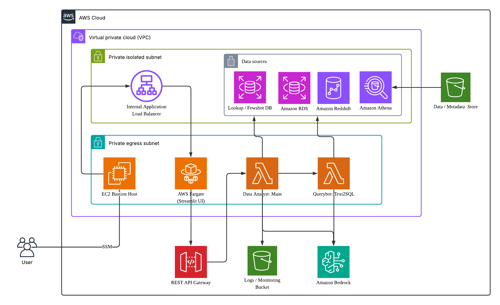

# Data Analyst BI ✨

A full-stack AI-powered business intelligence tool for non-experts (users not familar with SQL or need help writing complex analytics queries in SQL), featuring serverless backend processing and a secure Streamlit frontend interface.

https://github.com/user-attachments/assets/827ac4c9-9680-421a-88a7-c5dbe3cf55b8

## 🎯 Key Features

- **🤖 AI-Powered**: Natural language Text to SQL conversion using benchmarked LLMs
- **🚀 Modes**: Data Extraction, Reasoning and Visualisation Questions ✅
- **🪄 Error-Handling**: Assumes no knowledge of data and implements LLM reflection ✅
- **🛡️ Guardrails**: Customisable handling of non-BI queries ✅
- **⚡ Serverless Backend**: AWS Lambda for scalable data processing
- **📊 Streamlit Frontend**: Concurrent multi-user interactive web interface with ability to give feedback on response ✅
- **🗄️ Database Support**: PostgreSQL in RDS, Aurora Serverless, Redshift, S3/Athena ✅
- **🗄️ Vector Database**: PostgreSQL RDS lookup (historical similar questions), tools for metadata expansion and Few-shot support ✅
- **🛠️ Tools**: Code for data and metadata preparation ✅
- **🔐 Secure Access**: Bastion host with SSM Session Manager (no public IPs)
- **📋 Monitoring**: CloudWatch logs from all services for experimental debugging
- **🧱 Customisable**: Build your own data authorisation

Some of the unique features are highlighted by the ✅ icon.

## 🛠️ Core Services Required
- **Infrastructure**: CloudFormation, IAM, VPC/EC2, S3
- **Compute**: Lambda, ECS, Application Load Balancer
- **Database**: RDS, DynamoDB, Athena, Glue
- **AI/API**: Bedrock, API Gateway, Step Functions
- **Monitoring**: CloudWatch Logs, Systems Manager, EventBridge

## 🏗️ Architecture



### Backend (Serverless)
- **data-analyst Lambda**: Main orchestrator, handles requests and responses
- **querybot Lambda**: Specialized SQL generation using few-shot learning
- **Custom Layers**: Dependencies (pandas, psycopg2, s3fs, openpyxl)
- **API Gateway**: RESTful API with API key authentication
- **BYO-DB**: Bring your own DB - RDS, Aurora, Redshift, S3/Athena
- **Vector-DB**: Managed vector DB for look up and Few-shot example pairs

### Frontend (Container-based)
- **Streamlit Application**: Interactive web interface on ECS Fargate
- **Internal ALB**: Application Load Balancer (private, no internet access)
- **Auto-scaling**: CPU/memory-based scaling (1-5 tasks)

### Security & Access
- **EC2 Bastion Host**: Secure access via SSM Session Manager
- **No Public IPs**: All components in private subnets
- **VPC Architecture**: Private subnets with egress and isolated subnets
- **IAM Roles**: Least privilege access for all components

## 📋 Configuration

Key configuration files:
- `cdk.json`: CDK app configuration and VPC settings
- `layers/requirements.txt`: Lambda layer dependencies  
- `streamlit/`: Frontend application configuration
- Environment variables set via CDK deployment

## ⚡ Get Started
### Prerequisites

> [!IMPORTANT]
> Ensure all prerequisites are met before proceeding with deployment.

#### Required Software
- **Python 3.10+**: [Download](https://www.python.org/downloads/) | Check: `python --version`
- **AWS CLI v2.x**: [Install Guide](https://docs.aws.amazon.com/cli/latest/userguide/getting-started-install.html) | Check: `aws --version`
- **Session Manager Plugin for AWS CLI**: [Install Guide](https://docs.aws.amazon.com/systems-manager/latest/userguide/session-manager-working-with-install-plugin.html) | Check: Type `session-manager-plugin` 
- **Node.js 16+**: [Download](https://nodejs.org/en/download/) | Check: `node --version`
- **AWS CDK CLI v2.1019.2x**: Install: `npm install -g aws-cdk@latest` | Check: `cdk --version`
- **Docker**: [Install Guide](https://docs.docker.com/get-docker/) | Check: `docker --version`

#### AWS Account Requirements
- **AWS Account**: With programmatic access enabled
- **AWS Region**: Must support Bedrock (recommend us-east-1 or us-west-2), ECS, Lambda, RDS 
- **Existing VPC**: Must have properly configured subnets detailed in Scenario 2 below (if want to create from scratch use Scenario 1)
- **Metadata S3 Bucket**: Must pre-exist (if using S3-Athena, CSVs have to be placed here)

#### Metadata & Fewshot data

- To ensure optimal SQL generation quality, comprehensive schema metadata must be included in the prompt -  table descriptions and column descriptions in the format specified [metadata sample](data_templates/metadata/)
- There are two distinct invocation patterns for SQL generation: zeroshot and fewshot. While zeroshot approach serves as a baseline approach,  the fewshot approach significantly improves SQL accuracy by augmenting prompts with contextually relevant examples. The implementation utilizes a Postgres-based vector database that performs semantic similarity search to identify and retrieve the most relevant examples for each user query at inference time. The application supports two ways of creating these examples:

    * Standard NL-SQL Pairs:  
        * Structure: Natural language question paired with its corresponding SQL query
        * Learning mechanism: The foundation model infers semantic mapping between natural language intent and SQL syntax
        * Reference: Example template documentation available in the specified format available [fewshot without explanation](data_templates/fewshot/student_club_fshot_wo_expl_template.xlsx)

    * NL-SQL Pairs augmented with chain of thought and NL variation
        * Structure: Natural language question, corresponding SQL query, chain-of-thought reasoning steps, and question variation
        * Learning mechanism: The foundation model leverages explicit reasoning paths and linguistic variations to strengthen the association between user intent and SQL generation
        * Reference: Enhanced example template documentation available in the specified format available [fewshot with explanation](data_templates/fewshot/student_club_fshot_w_expl_template.xlsx)

#### Data setup for operational database

- Prior to deploying the application it is imperative to  establish a fully configured database environment with the required business and transactional data in place. The application supports RDS-Postgres, S3-Athena, and Redshift databases. If you already have your data in the database, you can go to the next section. However, if you have data in sqlite format, and want to export to RDS - Postgres  or Athena, follow the steps - 

- Migrating sqlite db to RDS Postgres:Users can migrate the data from sqlite to RDS Postgres using the utitlies available inside the tools/ directory
```bash
 * Ensure that the RDS database connection parameters are correctly set in the tools/config.py inside the tools folder
 * The sub-folder - sqlite_dbs must be there inside the tools folder and the database having extension - .sqlite must be available inside the sqlite_dbs sub-folder
 * Ensure that the path to the sqlitedb is set in the sqlite_dir parameter in tools/config.py
 * Open a terminal in sagemaker and type 
    (1) pip install -r requirements.txt 
    (2) python migrate_data_sqlite_postgres.py and select "all" when prompted
 * The sqlite tables will be migrated to RDS postgres
```

- Migrating sqlite db to S3-Athena: Users can convert the data from sqlite to csv format using the utitlies available inside the tools/ directory
```bash
 * Set the "database_path" and "output_directory" inside the main function available inside tools/convert_sqlite_to_S3DB.py
 * Open a terminal in sagemaker and type 
    (1) python convert_sqlite_to_S3DB.py
 * The above step will generate csvs in the output directory
 * The above csv files are to be stored inside the s3 bukcet created by the deployment step(detailed in the post deployment configuration)
```


### Deployment

#### Pre-Deployment Steps

Data Analyst BI offers extensive configuration options to adapt to your specific requirements. Here are the steps to be performed prior to deployment. 

1. Download Code and Setup Local Environment

```bash
git clone <repository-url>  # Clone repository
cd sample-data-analyst-bi 

# Install CDK dependencies
cd cdk && pip install -r requirements.txt && cd ..

# configure aws profile: this will enable you to talk to your aws services using the profile data-analyst
aws configure --profile data-analyst
```

Once the repository is cloned, the required configurations can be setup in the cdk.json

2. Model Selection and Parameters

Choose from various AWS Bedrock models and region to optimize for accuracy or cost:
cdk.json:

```json
{
 "sql_model_id": "us.anthropic.claude-3-7-sonnet-20250219-v1:0",
 "embedding_model_id": "cohere.embed-english-v3",
 "chat_model_id": "us.anthropic.claude-3-5-haiku-20241022-v1:0",
}
 ```

Other Model Configurations:

These configurations can be set in the `streamlit/UI/config.py` file before deployment.

- `plot_model_id`: Foundation model from Bedrock for generating visualisation code
- `expl_model_id`: Foundation model from Bedrock for explaining results from data

3. Model region

- `model_region`: AWS region for accessing the models

4. Prompting Strategy

```json
{
 "approach": "few_shot"  ## few_shot, # zero_shot
}
 ```

5. Database Integration

> [!NOTE]
> The platform supports three database types. Choose the one that matches your data infrastructure.

##### PostgreSQL
```json
{
  "api_db_host": "your-postgres-instance.region.rds.amazonaws.com",
  "api_db_port": 5432,
  "api_db_name": "your_database",
  "api_db_user": "your_user",
  "api_db_password": "your_password",
  "api_db_type": "postgresql"
}
```

##### Redshift
```json
{
  "api_db_host": "your-redshift-cluster.region.redshift.amazonaws.com",
  "api_db_port": 5439,
  "api_db_name": "your_database",
  "api_db_user": "your_user",
  "api_db_password": "your_password",
  "api_db_type": "redshift"
}
```

##### S3-Athena
```json
{
  "api_db_host": "",
  "api_db_port": 0,
  "api_db_name": "your_s3_data_lake_name",
  "api_db_user": "",
  "api_db_password": "",
  "api_db_type": "s3"
}
```

6. Metadata Enhancement

- Improve query accuracy with rich metadata
```json
{
"metadata_s3_bucket": "Bucket where metadata to be stored",
"metadata_is_meta": true,
"metadata_table_meta": "schema/your_tables.xlsx",
"metadata_column_meta": "schema/your_columns.xlsx",
"metadata_metric_meta": "schema/student_club_metrics.xlsx"
}
```
> [!TIP]
> For S3-Athena, the metadata S3 bucket must pre-exist before deployment.


7. Infrastructure Configuration

Depending on your deployment scenario, you may need to provide:

- `vpc_id`: existing vpc id, proper DNS resolution enabled
- `private_egress_subnet_1`: First private egress subnet with internet connectivity through NAT(Required for Fargate, lambda functions). With NAT Gateway access (for Lambda/ECS). Subnet must span multiple AZs.
- `private_egress_subnet_1`: Second private egress subnet with internet connectivity (Required for Fargate, lambda functions). With NAT Gateway access (for Lambda/ECS). Subnet must span multiple AZs.
- `private_isolated_subnet_1`: First private isolated subnet with no internet connectivity(Required for load balancer and databases). Subnet must span multiple AZs.
- `private_isolated_subnet_2`: Second private isolated subnet with no internet connectivity(Required for load balancer and databases). Subnet must span multiple AZs.
- `security_group`: Security group can be created with the appropriate inbound/outbound rules as given below or leave as "" if you want the deployment process to create the security group

    **Inbound Rules:**
    * `HTTP (80)` ← VPC CIDR: ALB to ECS communication
    * `HTTPS (443)` ← VPC CIDR: Secure web traffic
    * `PostgreSQL (5432)` ← VPC CIDR: Database access
    * `SSH (22)` ← VPC CIDR: Bastion host access
    * `Custom TCP (8501)` ← VPC CIDR: Streamlit application
    * `All Traffic` ← Self-reference: Inter-service communication

    **Outbound Rules:**
    * `HTTPS (443)` → 0.0.0.0/0: AWS API calls and Bedrock
    * `HTTP (80)` → 0.0.0.0/0: Package downloads
    * `PostgreSQL (5432)` → VPC CIDR: Database connections
    * `DNS (53 UDP/TCP)` → 0.0.0.0/0: Name resolution
    * `All Traffic` → Self-reference: Inter-service communication

You can leave the above fields(vpc, subnets, security) blank in the cdk.json if you want the deployment to create the infrastructure

#### Deployment Steps

<details>

<summary>
<b>Scenario 1: Have Poweruser Role To Deploy AWS Infra </b> </summary>


In this scenario you have AWS admin or poweruser role to allow the CDK to create and deploy VPCs, SubNets etc. Hence, you can just leave the empty strings empty in the cdk.json file and all those will be created during deployment. But do not forget to set your data / DB related permissions in the `cdk.json` (described later). If you forget to do it in the `cdk.json` there is a way to fix it also which will require you to go into the lambda code (described later).

#### Step 1: Deploy all stacks (this will take 15-30 minutes)

Make sure that the docker daemon is running in the background locally. Verify using `docker --version`.

```bash

# Set environment variable for all subsequent commands
export AWS_PROFILE=data-analyst

# Verify configuration
aws sts get-caller-identity

# Deploy stack
./deploy.sh deploy 

# Check deployment status
./deploy.sh status

```

#### Step 2: Connect with Deployed Application

```bash

# Create SSH tunnel to bastion host (includes key setup)
./ssh_tunnel.sh

# The script will:
# 1. Create temporary EC2 Instance Connect key pair
# 2. Push public key to bastion host
# 3. Create SSH tunnel on port 8080
# 4. Display access instructions
```

#### Step 3: Access Web Interface

```bash
# Open your browser to:
http://localhost:8080
```
</details>

<details>

<summary>
<b>Scenario 2: Do not Have Poweruser Role to Deploy AWS Infra </b> </summary>


In this scenario you do not have AWS admin or poweruser role to allow the CDK to create and deploy VPCs, SubNets etc. Someone with such an Admin role needs to create the VPC, SubNets etc for you and provide you with the essential IDs that you need to fill into your cdk.json file and deploy the application. 

Or else the Admin can deploy the solution for you using Scenario 1 and give you the `Access Key` and `Secret Key` for you to create the profile `data_analyst` to access the application.

Whoever is deploying do not forget to set your data / DB related permissions in the `cdk.json` (described later). If you forget to do it in the `cdk.json` there is a way to fix it also which will require you to go into the lambda code (described later).


#### Step 1: Verify that all the infrastructure Prerequisites as given in the Infrastructure Configuration

#### Step 2: Configure AWS CLI & Permissions

```bash
# Configure a dedicated profile
aws configure --profile data-analyst

# Set environment variable for all subsequent commands
export AWS_PROFILE=data-analyst

# Verify configuration
aws sts get-caller-identity
```

#### Required Permissions

> [!TIP]
> For development environments, use AWS managed policies. For production, implement least-privilege policies.

<details>
<summary><b>Permissions: For Quick Setup</b></summary>

```bash
# Attach these managed policies to your IAM user/role:
- PowerUserAccess
- IAMFullAccess  
- CloudWatchLogsFullAccess
```
</details>


<details>
<summary><b>Permissions: Production Policy Example</b></summary>

```json
{
    "Version": "2012-10-17",
    "Statement": [
        {
            "Effect": "Allow",
            "Action": [
                "cloudformation:*",
                "iam:*",
                "ec2:*",
                "rds:*",
                "lambda:*",
                "ecs:*",
                "elasticloadbalancing:*",
                "s3:*",
                "dynamodb:*",
                "apigateway:*",
                "logs:*",
                "athena:*",
                "glue:*",
                "states:*",
                "ssm:*",
                "application-autoscaling:*",
                "bedrock:*",
                "events:*",
                "sts:GetCallerIdentity"
            ],
            "Resource": "*"
        }
    ]
}
```

</details>

<details>
<summary><b>Permissions: Post-Deployment Minimal Role Policy</b></summary>

> [!TIP]
> Use this policy for day-to-day operations after deployment. It provides access to manage the service without full deployment permissions.

```json
{
    "Version": "2012-10-17",
    "Statement": [
        {
            "Sid": "CloudWatchLogsAccess",
            "Effect": "Allow",
            "Action": [
                "logs:DescribeLogGroups",
                "logs:DescribeLogStreams",
                "logs:GetLogEvents",
                "logs:FilterLogEvents",
                "logs:StartQuery",
                "logs:StopQuery",
                "logs:DescribeQueries",
                "logs:GetQueryResults"
            ],
            "Resource": [
                "arn:aws:logs:*:*:log-group:/aws/lambda/data-analyst-*",
                "arn:aws:logs:*:*:log-group:/data-analyst-*"
            ]
        },
        {
            "Sid": "LambdaManagement",
            "Effect": "Allow",
            "Action": [
                "lambda:GetFunction",
                "lambda:GetFunctionConfiguration",
                "lambda:UpdateFunctionCode",
                "lambda:UpdateFunctionConfiguration",
                "lambda:InvokeFunction",
                "lambda:ListFunctions",
                "lambda:GetLayerVersion",
                "lambda:ListLayers"
            ],
            "Resource": [
                "arn:aws:lambda:*:*:function:data-analyst-*",
                "arn:aws:lambda:*:*:layer:data-analyst-*"
            ]
        },
        {
            "Sid": "S3Access",
            "Effect": "Allow",
            "Action": [
                "s3:GetObject",
                "s3:PutObject",
                "s3:DeleteObject",
                "s3:ListBucket",
                "s3:GetObjectVersion",
                "s3:GetBucketLocation",
                "s3:GetBucketVersioning"
            ],
            "Resource": [
                "arn:aws:s3:::data-analyst-*",
                "arn:aws:s3:::data-analyst-*/*"
            ]
        },
        {
            "Sid": "BastionHostAccess",
            "Effect": "Allow",
            "Action": [
                "ec2:DescribeInstances",
                "ec2:DescribeInstanceStatus",
                "ec2-instance-connect:SendSSHPublicKey",
                "ssm:StartSession",
                "ssm:TerminateSession",
                "ssm:ResumeSession",
                "ssm:DescribeSessions",
                "ssm:GetConnectionStatus"
            ],
            "Resource": "*"
        },
        {
            "Sid": "ServiceMonitoring",
            "Effect": "Allow",
            "Action": [
                "ecs:DescribeServices",
                "ecs:DescribeTasks",
                "ecs:DescribeTaskDefinition",
                "ecs:ListTasks",
                "ecs:DescribeClusters",
                "apigateway:GET",
                "rds:DescribeDBInstances",
                "rds:DescribeDBClusters",
                "dynamodb:DescribeTable",
                "dynamodb:ListTables"
            ],
            "Resource": "*"
        },
        {
            "Sid": "SystemsManagerParameters",
            "Effect": "Allow",
            "Action": [
                "ssm:GetParameter",
                "ssm:GetParameters",
                "ssm:GetParametersByPath",
                "ssm:PutParameter"
            ],
            "Resource": "arn:aws:ssm:*:*:parameter/data-analyst/*"
        },
        {
            "Sid": "BasicAccess",
            "Effect": "Allow",
            "Action": [
                "sts:GetCallerIdentity",
                "cloudformation:DescribeStacks",
                "cloudformation:DescribeStackResources",
                "cloudformation:ListStacks"
            ],
            "Resource": "*"
        }
    ]
}
```

**What this policy allows:**
- **View and search logs** in CloudWatch for all Data Analyst components
- **Update Lambda functions** code and configuration
- **Access S3 buckets** created by the platform for data upload/download
- **Connect to bastion host** via SSM Session Manager and EC2 Instance Connect
- **Monitor service health** across ECS, RDS, DynamoDB, and API Gateway
- **Manage configuration** via Systems Manager parameters
- **Basic AWS operations** for service monitoring

**What this policy does NOT allow:**
- Creating or deleting infrastructure
- Modifying IAM roles or policies
- Changing VPC or security group settings
- Accessing other AWS accounts or unrelated resources

</details>

#### Verify Access
```bash
# Test key service access 
# for deployment below us-east-1 is an example, use the region where you deployed
# Note: region in which you will access Bedrock is by default us-east-1

aws cloudformation list-stacks --region us-east-1  
aws ec2 describe-vpcs --region us-east-1  
aws bedrock list-foundation-models --region us-east-1
```
Once you have set up the AWS infrastructure lets deploy the application

#### Validate Configuration
```bash
# Verify VPC exists
aws ec2 describe-vpcs --vpc-ids $(grep vpc_id cdk/cdk.json | cut -d'"' -f4)

# Check Bedrock model access
aws bedrock list-foundation-models --region us-east-1 | grep -E "(claude-3|cohere)"
```

#### Step 3: Deploy

> [!NOTE]
> Deployment typically takes 15-30 minutes. Monitor progress in the AWS CloudFormation console.

#### Deploy Infrastructure

Make sure that the docker daemon is running in the background locally. Verify using `docker --version`.

```bash
# Deploy all stacks (this will take 15-30 minutes)
export AWS_PROFILE=data-analyst
./deploy.sh deploy
```

#### Verify Deployment
```bash
# Check stack status
export AWS_PROFILE=data-analyst
./deploy.sh status
```

#### Step 6: Access the Application

#### Create Secure Tunnel
```bash
# Create SSH tunnel to bastion host (includes key setup)
./ssh_tunnel.sh

# The script will:
# 1. Create temporary EC2 Instance Connect key pair
# 2. Push public key to bastion host
# 3. Create SSH tunnel on port 8080
# 4. Display access instructions
```

#### Access Web Interface
```bash
# Open your browser to:
http://localhost:8080
```

#### Step 7: Verify & Test

#### Test Data Analyst Functionality
1. **Access Streamlit Interface**: Verify the web interface loads properly
2. **Test Natural Language Query**: Try "Show me the first 10 rows from any table"
3. **Check Database Connection**: Verify connection to your configured database
4. **Monitor Logs**: Check CloudWatch logs for any errors

```bash
# View real-time logs
./view_logs.sh data-analyst
./view_logs.sh querybot
./view_logs.sh streamlit
```
</details>

<details>
<summary> <b>Scenario 3: Make Changes to DB and Model Choices After Deployment</b> </summary>


After deployment it is possible to point to a different DB, metadata or change your models to a different model ID in a different region.

For this you need to make changes to the `code/data-analyst/lambda_function.py` code that gets deployed as a lambda function and should be accessible from the `data_analyst_backend` stack.

```code
# The following variable carries all the DB related information
db_conn_conf = parsed_input.get("db_conn_conf")

# db_conn_conf consists of the following fields that you can fill up depending on the type of DB you are using
# Refer to the section on Supported Database Types with the appropriate prefix like api_ pr, api_db_ removed from the key
db_conn_conf = {
   'db_type': #,
   'host': #,
   'user': #,
   'password': #,
   'database': #,
   'port': #
}

# Change model ID. Note you need to provide the exact model ID available in the region and verify that 
chat_model_id =  parsed_input.get("chat_model_id")
sql_model_id =  parsed_input.get("sql_model_id")
plot_model_id = parsed_input.get("plot_model_id")
embedding_model_id = parsed_input.get("embedding_model_id")
expl_model_id = parsed_input.get("expl_model_id")
```

Make sure to deploy the lambda function.

</details>

#### Post-Deployment configuration

After successful deployment, consider these optimization and customization steps to improve the quality of generated SQL

##### 1. Setting Up Cache/Fewshot Examples:

A. Integration of Caching and Few-Shot Learning

Both the cached question-SQL pairs and few-shot examples are stored in the same table of the PostgreSQL vector database (RDS) that's created during deployment. This integration creates a synergistic system where:

    * Cached question-SQL pairs approved by users serve as additional few-shot examples
    * The growing collection of examples progressively improves the model's SQL generation capabilities
    * The system becomes more efficient and accurate over time through normal usage

The following steps detail the steps to create the cache table in the vector database and ingest the initial few-shot examples:

```bash
a. Copy the tools folder available inside the parent directory to a Sagemaker notebook instance/EC2
b. The Sagemaker instance/EC2 should be in the same VPC and the security group as the vector database(RDS postgres). The subnet choosen must be in a private egress subnet linked to a NAT gateway.
c. The configurations for setting up cache and ingesting fewshot examples are in the config.py inside the tools folder -  the embedding model name, the configuration for the vector database etc. Set these values as required
e. In a terminal, run pip install -r requirements.txt to install the required dependencies
f. Run python create_cache.py to create the cache table in the RDS postgres vector database
g. Ensure that the examples are added to the spreadsheet file - tools/fshot_data/examples.xlsx
h. Run python  create_python_fshot_examples.py to ingest the examples in the cache table in the vector database
```

##### Prompt configurations

The query bot lambda is responsible for invoking foundation models to generate SQL. The various prompts which can be be used to  do so are available inside querybot → scripts → prompts.py. These can be customized based on the business requirements.

- **System prompt for SQl generation** :

```bash
You are an expert SQL query generator.
Given an input question and a database schema within the <schema></schema> tag, create a precise, syntactically correct and efficient SQL query.
please follow the instructions while generating the sql:
1.Please generate SQL compatible with {sql_database} database.
2.Ensure that the generated SQL select statement includes all relevant factors including identifier or filter columns mentioned in the input question.
3.Always include identifier columns in the SELECT clause when they are used in WHERE conditions.
```

- **Zeroshot prompt for SQl generation** -
```bash
BEDROCK_ZS_SQL_PROMPT -> 
The database schema below contains the following fields:
- Table name
- Column names
- Column data types
- Key information

Given the database schema within the <schema></schema> tags 

<schema>
{schema}
</schema>

generate a SQL statement for the question within the <question></question> tags:

<question>
{question}
</question>

Put your answer in <sql></sql> tag.
```

- **Fewshot prompt for SQl generation** -
```bash
BEDROCK_FS_SQL_PROMPT:
For each table, you are provided with some or all of the following
    - Table name
    - Column names
    - Column data types
    - Key information

Given the database schema within the <schema></schema> tags 

<schema>
{schema}
</schema>

and the following example pairs of question , sql queries, explanation of the SQL query and a similar question created from the SQL given within the <example></examples> tags

<examples>
{examples}
</examples>

generate a SQL statement for the question within the <question></question> tags

<question>
{question}
</question>
```

The data analyst lambda is responsible for invoking foundation models to generate python query required for chart generation. The prompts which can be be used to  do so are available inside data-analyst/scripts/query_db/prompt_config_clv3.py. This can be customized based on the business requirements.

- **Fewshot prompt for python code generation** -

```bash
You are an expert python coder. You are good at writing python code to create different types of plots. Follow the instructions in the <instructions> tag to create python code for generating the plot asked by the user. A sample of actual data on which the plot is to be generated is given in the <actual_data_sample> tag.
Donot apply filters to the data, the data is already filtered.

Given below is the path to the data you should load
<data_path>
{file_path}
</data_path>

Given below is the sample of the actual data which contains all the required columns to create the plot
<actual_data_sample>
{sample}
</actual_data_sample>

Some examples are given in the <example> tag on how to interpret the data and create plots.
<examples>
{ex}
</examples>

Some rules to be followed while plotting are given below:
<plotting_rules>
1.In the x axis, the x tick values should be rotated by 90 degrees
2.while plotting grouped barcharts, the barwidth should be added to the numeric number
</plotting_rules>

<instructions>
(1).Your job is to create plots on the data given in the <actual_data_sample> tag corresponding to the question passed by the user.
(2).Think step by step - follow the instructions given below to generate charts
(3).Create a python function - load the data from the path given inside <data_path> tag.
(4).Import all the required libraries inside the python function
(5).Refer to the examples in the the <examples>tag if available for guidance
(6).Follow the plotting rules given in the <plotting_rules> tag
(7).The python function that you create should return the figure
(8).The plots should be in the same figure plot and use different color codes to represent different entities
(9).After the function definition, assign the relevant data filenames to appropriate variables
(10).Call the python function after the end of the function definition with the filename variables 
(11).Collect the returned value from the function call in a variable named "plot_out". Donot deviate from this
(12).If the data is not available, then donot plot and return empty figure
(13).Return your the python function definition and function call inside the <answer> tag and your step by step reasoning to construct python defintion in the <explanation> tag
</instructions>

IMPORTANT - 
(1). You should import all the required libraries such as matplotlib, pandas inside the python function definition
(2). Before creating the python function, check what columns are available for the data in <actual_data_sample> tag. You should not filter the data for any values inside the function definition
(3). Only use columns available in <actual_data_sample> tag to perform any data transformations needed inside the pythom function definition. You should not refer to any columns not available in the data inside <actual_data_sample> tag
(4). Just reminding you that your job is to create a python function to generate plot. No filters are required on the data
```

##### Foundation model hyperparameters

The foundation model’s hyperparameters can also influence the accuracy of SQL. Hyperparameter configuration can be set in the following path -  querybot/scripts/config.py

A sample configuration is shown below:

```bash
LLM_CONF:"us.anthropic.claude-3-7-sonnet-20250219-v1:0": {
"temperature": 0,
"top_p": 1,
"top_k": 250,
"max_tokens": 200,
"anthropic_version": "bedrock-2023-05-31",
"stop_sequences": ["</sql>"],
"performanceConfig": "standard"
},
"us.anthropic.claude-3-5-haiku-20241022-v1:0": {
"temperature": 0,
"top_p": 1,
"top_k": 250,
"max_tokens": 200,
"anthropic_version": "bedrock-2023-05-31",
"stop_sequences": ["</sql>"],
"performanceConfig": "optimized"
}
```

##### Fewshot example selection threshold score

Few-shot examples are maintained in a cache table within our RDS PostgreSQL vector database. When processing user queries, the system dynamically retrieves semantically similar examples to enhance SQL generation accuracy.

Users can customize the semantic similarity threshold through the following:

    * File Path: querybot/scripts/config.py
    * Variable: AOSS_RELEVANCE_THRESHOLD
    * Valid Range: 0.0 to 1.0

A higher threshold value will retrieve only highly similar examples, while a lower threshold will include more diverse examples with less strict matching criteria.

##### S3-Athena folder directory 

The CSV files for S3-Athena databse are to be stored inside the S3 bucket created by the deployment. The content inside the S3 bucket should be structured as follows:

```
bucket-created-by-deployment>
|__ <DB name>
   |___ data
   |     |___ <folder with same name as table_name 1>
   |     |    |___ table_name 1.csv
   |     |___ <folder with same name as table_name 2>
   |     |    |___ table_name 2.csv
   |___ metadata
        |___ <tables description xlsx file>
        |___ <columns description xlsx file>
        |___ <metrics description xlsx file>
```


## 🚨 Troubleshooting Deployment Issues

> [!TIP]
> Most deployment issues are related to permissions or VPC configuration. Check these first.

<details>
<summary><b>Permission Denied Errors</b></summary>

**Symptoms**: CloudFormation deployment fails with permission errors

**Solutions**:
```bash
# Check your AWS identity
aws sts get-caller-identity

# Verify required permissions (see Step 2)
# Contact your AWS administrator if permissions are insufficient
```

</details>

<details>
<summary><b>VPC/Subnet Issues</b></summary>

**Symptoms**: Stack creation fails with subnet/VPC errors

**Solutions**:
```bash
# Verify VPC exists
aws ec2 describe-vpcs --vpc-ids your-vpc-id

# Check subnet configuration
aws ec2 describe-subnets --filters "Name=vpc-id,Values=your-vpc-id"

# Ensure subnets are in different AZs
aws ec2 describe-availability-zones --region your-region
```

</details>

<details>
<summary><b>Bedrock Model Access</b></summary>

**Symptoms**: Lambda functions fail with Bedrock access errors

**Solutions**:
> [!CAUTION]
> Bedrock models require explicit access approval in the AWS Console.

```bash
# Check model availability in your region
aws bedrock list-foundation-models --region your-region

# Enable Bedrock models in AWS Console:
# 1. Go to Amazon Bedrock console
# 2. Navigate to Model access
# 3. Request access to required models (Claude, Cohere)
```

</details>

<details>
<summary><b>Docker Issues</b></summary>

**Symptoms**: Layer building fails or ECS deployment issues

**Solutions**:
```bash
# Verify Docker is running
docker info

# For Mac users, ensure Docker Desktop is running
# For Linux users, start Docker service:
sudo systemctl start docker

# Test Docker with a simple command
docker run hello-world
```

</details>

<details>
<summary>
<b>Deeper Insights of How the Solution Works</b>
</summary>

## 📊 Architecture Flow

### High-Level Data Flow
```
User Query → Streamlit UI → API Gateway → Data Analyst Lambda → QueryBot Lambda → Database
     ↑                                           ↓                      ↓
     └── Results ← Response Processing ← SQL Execution ← SQL Generation ←┘
```

### Detailed Processing Flow

#### 1. **User Interaction**
```
User (SSH Tunnel) → Streamlit UI (ECS) → API Gateway → Data Analyst Lambda
```
- User connects via secure SSH tunnel to bastion host
- Accesses Streamlit interface running on ECS Fargate
- Submits natural language query through web interface
- Request routed through API Gateway with authentication

#### 2. **Query Processing Pipeline**
```
Data Analyst Lambda:
├── Input Validation & Authentication
├── Cache Check (Vector Similarity Search)
│   ├── If Found: Return Cached SQL + Results
│   └── If Not Found: Continue to Generation
├── Schema Extraction (Database/S3 Metadata)
├── Question Intent Classification (SQL/Plot/Chat)
└── Route to Appropriate Handler
```

#### 3. **SQL Generation (QueryBot Lambda)**
```
QueryBot Lambda:
├── Few-Shot Learning (Vector Examples)
├── Schema Context Injection
├── Bedrock Model Invocation
├── SQL Query Generation
├── Query Validation & Optimization
└── Return Generated SQL
```

#### 4. **Execution & Response**
```
Data Analyst Lambda:
├── Execute SQL Against Target Database
│   ├── PostgreSQL/Redshift: Direct Connection
│   └── S3: Athena Query Execution
├── Process Results (DataFrame)
├── Generate Natural Language Explanation
├── Cache Successful Query-Result Pairs
└── Return Formatted Response
```

#### 5. **Caching System**
```
Vector Database (PostgreSQL + pgvector):
├── Store: Question Embeddings + SQL Queries
├── Search: Cosine Similarity for Query Matching
├── Threshold: Configurable similarity matching
└── Performance: Sub-second cache retrieval
```

### Component Interactions

#### **Data Analyst Lambda** (Main Orchestrator)
- **Input**: Natural language queries, database configurations
- **Functions**: Request validation, caching, schema extraction, response formatting
- **Outputs**: SQL results, explanations, visualizations
- **Dependencies**: QueryBot Lambda, PostgreSQL, target databases

#### **QueryBot Lambda** (SQL Generator)
- **Input**: Processed queries, schema context, few-shot examples
- **Functions**: AI-powered SQL generation using Bedrock models
- **Outputs**: Optimized SQL queries with explanations
- **Dependencies**: Bedrock (Claude/Cohere), vector database

#### **Vector Cache System**
- **Storage**: PostgreSQL with pgvector extension
- **Function**: Semantic similarity search for query caching
- **Performance**: Reduces response time from ~10s to ~2s for similar queries
- **Intelligence**: Learns from successful query patterns

#### **Database Connectivity**
- **PostgreSQL/Redshift**: Direct psycopg2 connections
- **S3/Athena**: Boto3 with Glue catalog integration
- **Schema Discovery**: Automated metadata extraction and caching
- **Security**: VPC endpoints, private subnets, encrypted connections

### Security Architecture
- **No Public IPs**: All components in private/isolated subnets
- **Bastion Access**: SSM Session Manager (no SSH keys required)
- **EC2 Instance Connect**: Temporary SSH key injection for tunneling
- **VPC Endpoints**: Private connectivity to AWS services
- **API Keys**: Secured API Gateway access
- **IAM Roles**: Least privilege access
- **Security Groups**: Restrictive network access controls

## 🔧 Management Commands

### Deployment
```bash
./deploy.sh deploy           # Deploy full infrastructure
./deploy.sh redeploy         # Destroy and redeploy everything
./deploy.sh destroy          # Clean up all resources
./deploy.sh status           # Check deployment status
./deploy.sh build-layers     # Build custom Lambda layers only
./deploy.sh cleanup          # Clean build artifacts
```

### Monitoring
```bash
# View Lambda logs using the view_logs.sh script
./view_logs.sh data-analyst    # View data-analyst Lambda logs
./view_logs.sh querybot        # View querybot Lambda logs
./view_logs.sh streamlit       # View Streamlit application logs

# Or use AWS CLI directly
aws logs tail /aws/lambda/data-analyst-data-analyst --profile profile_name --follow
aws logs tail /aws/lambda/data-analyst-querybot --profile profile_name --follow
aws logs tail /data-analyst-streamlit-ui --profile profile_name --follow
```

### Access Management
```bash
# Create tunnel (includes key management)
./ssh_tunnel.sh

# Get bastion instance ID
aws cloudformation describe-stacks --stack-name data-analyst-frontend \
  --query "Stacks[0].Outputs[?OutputKey=='BastionHostInstanceId'].OutputValue" \
  --output text --profile profile_name
```


## 🗂️ Project Structure

```
DataAnalyst/
├── cdk/                          # AWS CDK Infrastructure as Code
│   ├── app.py                    # CDK app entry point
│   ├── cdk.json                  # CDK configuration
│   └── stacks/
│       ├── backend_stack.py      # Lambda functions, RDS, API Gateway
│       ├── frontend_stack.py     # ECS, ALB, Bastion host
│       └── vpc_endpoints_stack.py # VPC endpoints for AWS services
├── code/
│   ├── data-analyst/             # Main orchestrator Lambda function
│   │   ├── lambda_function.py    # Main Lambda handler
│   │   ├── scripts/
│   │   │   ├── orchestrator_db.py # Core orchestration logic
│   │   │   ├── cache_operations.py # Vector cache operations
│   │   │   ├── time_tracker.py   # Performance monitoring
│   │   │   └── query_db/         # Database query modules
│   │   │       ├── classifier.py # Query classification
│   │   │       ├── get_schema_str.py # Schema extraction
│   │   │       ├── pgsql_executor.py # SQL execution
│   │   │       └── postprocessor.py # Result processing
│   │   └── db_data/              # Sample data and schemas
│   ├── querybot/                 # SQL generation Lambda function
│   │   ├── lambda_function.py    # QueryBot Lambda handler
│   │   └── scripts/
│   │       ├── sql/              # SQL generation modules
│   │       │   ├── generator.py  # SQL query generation
│   │       │   ├── executor.py   # SQL execution helpers
│   │       │   └── evaluator.py  # Query evaluation
│   │       └── support/          # Support utilities
│   └── tools/                    # Tools for CSV import into S3-Athena
├── layers/                       # Custom Lambda layers
│   ├── data-analyst-requirements.txt
│   ├── querybot-requirements.txt
│   └── create_*_layer_zip.sh     # Layer build scripts
├── streamlit/                    # Streamlit web application
│   ├── Dockerfile               # Container configuration
│   └── UI/
│       ├── Home.py              # Main Streamlit app
│       ├── config.py            # UI configuration
│       └── pages/
│           └── DataAnalyst.py   # Data analysis interface
├── tools/                       # Development utilities - setting up cache/vector examples (Refer to Testing.md, section on Setting up the cache/fewshot examples)
├── deploy.sh                    # Main deployment script
├── ssh_tunnel.sh               # Secure access tunnel script
└── view_logs.sh                # Log viewing utility
```
</details>

## 🔒 Security Features

- **No Public Access**: All resources in private subnets
- **Bastion Host**: SSM Session Manager access only (no SSH keys required)
- **EC2 Instance Connect**: Temporary SSH key injection for tunneling
- **VPC Endpoints**: Private connectivity to AWS services
- **API Keys**: Secured API Gateway access
- **IAM Roles**: Least privilege access
- **Security Groups**: Restrictive network access controls

## 🚨 Troubleshooting

### Access Issues
```bash
# Check bastion host status
aws ec2 describe-instances --instance-ids <INSTANCE-ID> --profile profile_name

# Test tunnel creation
./ssh_tunnel.sh -l 8080

# Verify ALB health
aws elbv2 describe-target-health --target-group-arn <TARGET-GROUP-ARN> --profile profile_name
```

### Application Issues
```bash
# Check ECS service status
aws ecs describe-services --cluster data-analyst-streamlit-cluster \
  --services data-analyst-streamlit --profile profile_name

# View container logs
aws logs tail /data-analyst-streamlit-ui --profile profile_name
```

### Lambda Issues
```bash
# Check Lambda function logs
aws logs tail /aws/lambda/data-analyst-data-analyst --profile profile_name

# Verify environment variables
aws lambda get-function-configuration --function-name data-analyst-data-analyst --profile profile_name
```

### Database Issues
```bash
# Verify RDS instance
aws rds describe-db-instances --db-instance-identifier data-analyst-postgres-db --profile profile_name

# Check database credentials
aws secretsmanager get-secret-value --secret-id data-analyst-db-credentials --profile profile_name
```

## 💡 Usage Tips

- **First Time**: Allow ~5 minutes for ECS service to fully start
- **Tunnel**: Use `./ssh_tunnel.sh` for easiest access
- **Scaling**: ECS auto-scales based on CPU/memory usage
- **Logs**: Check CloudWatch for debugging both Lambda and ECS issues
- **Security**: No permanent SSH keys required - uses EC2 Instance Connect

<details>
<summary>
🚨 <font size="5"> <b>FAQ</b> </font>


</summary>


**Q: What is difference with LLM based chatbots that also generate SQL from text?**

**A:** An accurate Text2SQL solution using LLMs hinges on two key components: (1) providing the LLM with the accurate context as part of the prompt and (2) implementing the ability to reflect and make at least syntactic corrections to the LLM generated query which requires ability to connect with the DB. 

Out of the box, chatbots lack both these components as this can require complex integrations. For example, the context needs to be aware of the table and column descriptions, primary key, foreign key, data type and metric definitions. All this information is stored somewhere else or sometimes not available. Note that this information can be huge in size so the solution needs to be able to select the appropriate metadata relevant for the question. 

Similarly, in a few shot setting specialised methods are required to describe example pairs and match it to the question. Thus, although LLM based chats can generate a SQL corresponding to a question, due to lack of relevant context and inability to self rectify it mostly hallucinates.


**Q: Is the visualisation feature similar to LLM based data visualisation dashboarding solutions?**

**A:** No. The visualisation features goal is not to provide a dashboarding experience but to complement in the ability to converse with the solution to get both textual and visual representations of the questions response. At present the visualisation cannot be updated to get different visual representations of the same data.


**Q: Does the user need to know about the data fields and schema?**

**A:** No. The solution samples data from the DB to filter and provide the LLM with values that help in avoiding the LLM hallucinating about the specific data values. In many cases this helps the solution respond to questions that are not exact on the values and expects knowledge of conversational context.

**Q: Why call it a business intelligence tool and not a Text2SQL tool?**

**A:** The solution goes beyond Text2SQL and aims to provide a hands-free experience for business leaders and owners to get insights on the health of their business once they connect their data repositories to it. Our solution works backward in addressing our customers most pressing business requirements.


**Q: What are some of the roadmap features in `data-analyst-bi`?**

**A:** Our focus is always on improving accuracy while reducing latency and cost. 

- The present solution uses primarily AWS serverless services to reduce OPEX. 

- We also provide several common sense features to reduce latency like allowing the user to state nature of the question, give feedback on approval of a response that circles back to collecting valid example pairs in fewshot setting, inturn improving the context.

- Expect modules for auto generation of metadata to be added to help generate better context.

- The solution presently uses closed LLM models. Future releases will implement the ability to choose and deploy open source LLM models.

</details>

## Contributors

- [Adithya Suresh](https://www.linkedin.com/in/adithyaxx/) - Deep Learning Architect, AWS Generative AI Innovation Center
- [Debasish Mishra](https://www.linkedin.com/in/debnitxl/) - Senior Data Scientist, AWS Generative AI Innovation Center
- [Milly Nguyen](https://www.linkedin.com/in/milly-nguyen/) - Associate Solutions Architect, AWS Global Sales
- [Sujoy Roy](https://www.linkedin.com/in/sujoy-roy-95523136/) - Principal Applied Scientist, AWS Generative AI Innovation Center

## License

This project is licensed under the terms of the MIT-0 License. See the [LICENSE](./LICENSE) file for details.
