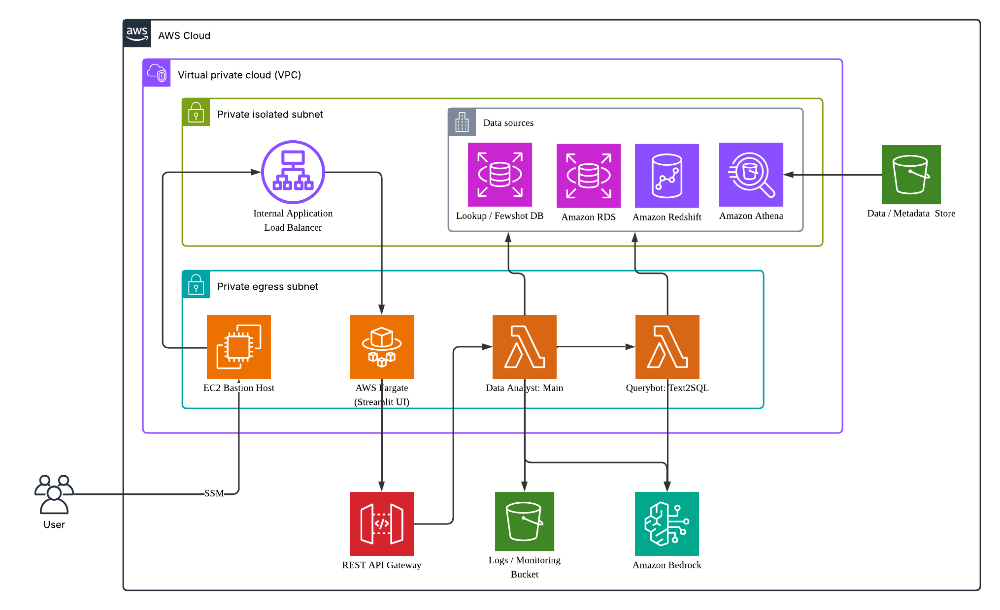

# Data Analyst BI ✨

A full-stack AI-powered business intelligence tool for non-experts, featuring serverless backend processing and a secure Streamlit frontend interface.

https://github.com/user-attachments/assets/827ac4c9-9680-421a-88a7-c5dbe3cf55b8

## 🎯 Key Features

- **🤖 AI-Powered**: Natural language Text to SQL conversion using benchmarked LLMs
- **🚀 Modes**: Data Extraction, Reasoning and Visualisation Questions
- **🪄 Error-Handling**: Assumes no knowledge of data and implements LLM reflection
- **🛡️ Guardrails**: Customisable handling of non-BI queries
- **⚡ Serverless Backend**: AWS Lambda for scalable data processing
- **📊 Streamlit Frontend**: Concurrent multi-user interactive web interface 
- **🗄️ Database Support**: PostgreSQL in RDS, Aurora Serverless, Redshift, S3/Athena
- **🗄️ Vector Database**: PostgreSQL RDS for lookup (no need to generate SQL) and Few-shot support
- **🔐 Secure Access**: Bastion host with SSM Session Manager (no public IPs)
- **📋 Monitoring**: CloudWatch logs from all services for experimental debugging
- **🧱 Customisable**: Build your own data authorisation

## 🏗️ Architecture



### Backend (Serverless)
- **data-analyst Lambda**: Main orchestrator, handles requests and responses
- **querybot Lambda**: Specialized SQL generation using few-shot learning
- **Custom Layers**: Dependencies (pandas, psycopg2, s3fs, openpyxl)
- **API Gateway**: RESTful API with API key authentication
- **BYO-DB**: Bring your own DB - RDS, Aurora, Redshift, S3/Athena
- **Vector-DB**: Managed vector DB for look up and Few-shot example pairs

### Frontend (Container-based)
- **Streamlit Application**: Interactive web interface on ECS Fargate
- **Internal ALB**: Application Load Balancer (private, no internet access)
- **Auto-scaling**: CPU/memory-based scaling (1-5 tasks)

### Security & Access
- **EC2 Bastion Host**: Secure access via SSM Session Manager
- **No Public IPs**: All components in private subnets
- **VPC Architecture**: Private subnets with egress and isolated subnets
- **IAM Roles**: Least privilege access for all components

## 📋 Configuration

Key configuration files:
- `cdk.json`: CDK app configuration and VPC settings
- `layers/requirements.txt`: Lambda layer dependencies  
- `streamlit/`: Frontend application configuration
- Environment variables set via CDK deployment

## ⚡ Get Started
### Prerequisites

> [!IMPORTANT]
> Ensure all prerequisites are met before proceeding with deployment.

#### Required Software
- **Python 3.10+**: [Download](https://www.python.org/downloads/) | Check: `python --version`
- **AWS CLI v2.x**: [Install Guide](https://docs.aws.amazon.com/cli/latest/userguide/getting-started-install.html) | Check: `aws --version`
- **Session Manager Plugin for AWS CLI**: [Install Guide](https://docs.aws.amazon.com/systems-manager/latest/userguide/session-manager-working-with-install-plugin.html) | Check: Type `session-manager-plugin` 
- **Node.js 16+**: [Download](https://nodejs.org/en/download/) | Check: `node --version`
- **AWS CDK CLI v2.1019.2x**: Install: `npm install -g aws-cdk@latest` | Check: `cdk --version`
- **Docker**: [Install Guide](https://docs.docker.com/get-docker/) | Check: `docker --version`

#### AWS Account Requirements
- **AWS Account**: With programmatic access enabled
- **AWS Region**: Must support Bedrock (recommend us-east-1 or us-west-2), ECS, Lambda, RDS 
- **Existing VPC**: Must have properly configured subnets detailed in Scenario 2 below (if want to create from scratch use Scenario 1)
- **Metadata S3 Bucket**: Must pre-exist (if using S3-Athena, CSVs have to be placed here)

## Deployment Scenarios

<details>

<summary>
<b>Scenario 1: Have Poweruser Role To Deploy AWS Infra </b> </summary>


In this scenario you have AWS admin or poweruser role to allow the CDK to create and deploy VPCs, SubNets etc. Hence, you can just leave the empty strings empty in the cdk.json file and all those will be created during deployment. But do not forget to set your data / DB related permissions in the `cdk.json` (described later). If you forget to do it in the `cdk.json` there is a way to fix it also which will require you to go into the lambda code (described later).

#### Step 1: Download Code and Setup Local Environment

```bash
git clone <repository-url>  # Clone repository
cd sample-data-analyst-bi 

# Install CDK dependencies
cd cdk && pip install -r requirements.txt && cd ..

# configure aws profile: this will enable you to talk to your aws services using the profile data-analyst
aws configure --profile data-analyst
```
#### Step 2: Set DB Configurations

**REQUIRED Database Configuration:**

These configurations can be set in the `cdk/cdk.json` file before deploying.
- `db_name`: Fewshot DB name. Can be any name you decide as a new RDS instance will be created (REQUIRED) 
- `db_username`: Fewshot DB user name. Can be any name you decide as a new RDS instance will be created(REQUIRED)
- `db_password`: Fewshot DB password. Can be any password you decide as a new RDS instance will be created (REQUIRED)
- `api_db_host`: Existing Redshift / RDS database host URL. Leave empty for S3 / Athena (REQUIRED)
- `api_db_port`: Existing Redshift (5439) / RDS (5432) database port. No port for S3 / Athena (REQUIRED)
- `api_db_name`: Existing Redshift / RDS database name. Provide S3 bucket name for S3 / Athena (REQUIRED)
- `api_db_user`: Existing Redshift / RDS database user name. Empty for S3 / Athena (REQUIRED)
- `api_db_password`: Existing Redshift / RDS database password. Empty for S3 / Athena (REQUIRED)
- `api_db_type`: Database type - `postgresql` (for RDS), `redshift`, or `s3` (REQUIRED)

**OPTIONAL Metadata and Model Configurations:**

These configurations can be set in the `cdk/cdk.json` file before deploying.
- `model_region`: AWS region for accessing the models
- `sql_model_id`: Bedrock model for SQL generation
- `chat_model_id`: Bedrock model for chat responses  
- `embedding_model_id`: Bedrock model for vector embeddings
- `approach`: Examples selection method (`few_shot` or `zero_shot`)
- `metadata_s3_bucket`: S3 bucket for metadata (must pre-exist)
- `metadata_is_meta`: Enable metadata-driven schema discovery
- `metadata_table_meta`: S3 key for table metadata Excel file
- `metadata_column_meta`: S3 key for column metadata Excel file

**OPTIONAL Model Configurations:**

These configurations can be set in the `streamlit/UI/config.py` file before deployment.

- `plot_model_id`: Bedrock model for generating visualisation code
- `expl_model_id`: Bedrock model for explaining results from data


#### Step 3: Deploy all stacks (this will take 15-30 minutes)

Make sure that the docker daemon is running in the background locally. Verify using `docker --version`.

```bash

# Set environment variable for all subsequent commands
export AWS_PROFILE=data-analyst

# Verify configuration
aws sts get-caller-identity

# Deploy stack
./deploy.sh deploy 

# Check deployment status
./deploy.sh status

```

#### Step 4: Connect with Deployed Application

```bash

# Create SSH tunnel to bastion host (includes key setup)
./ssh_tunnel.sh

# The script will:
# 1. Create temporary EC2 Instance Connect key pair
# 2. Push public key to bastion host
# 3. Create SSH tunnel on port 8080
# 4. Display access instructions
```

#### Step 5: Access Web Interface

```bash
# Open your browser to:
http://localhost:8080
```
</details>

<details>

<summary>
<b>Scenario 2: Do not Have Poweruser Role to Deploy AWS Infra </b> </summary>


In this scenario you do not have AWS admin or poweruser role to allow the CDK to create and deploy VPCs, SubNets etc. Someone with such an Admin role needs to create the VPC, SubNets etc for you and provide you with the essential IDs that you need to fill into your cdk.json file and deploy the application. 

Or else the Admin can deploy the solution for you using Scenario 1 and give you the `Access Key` and `Secret Key` for you to create the profile `data_analyst` to access the application.

Whoever is deploying do not forget to set your data / DB related permissions in the `cdk.json` (described later). If you forget to do it in the `cdk.json` there is a way to fix it also which will require you to go into the lambda code (described later).

**Core Services Required:**
- **Infrastructure**: CloudFormation, IAM, VPC/EC2, S3
- **Compute**: Lambda, ECS, Application Load Balancer
- **Database**: RDS, DynamoDB, Athena, Glue
- **AI/API**: Bedrock, API Gateway, Step Functions
- **Monitoring**: CloudWatch Logs, Systems Manager, EventBridge

#### Step 1: Verify Infrastructure Prerequisites

**Required Infrastructure:**
- **VPC**: Existing VPC with proper DNS resolution enabled
- **2 Private Egress Subnets**: With NAT Gateway access (for Lambda/ECS)
- **2 Private Isolated Subnets**: Without internet access (for RDS)
- **1 Security Group**: With required rules (see below)
- **Different Availability Zones**: All subnets must span multiple AZs

#### Security Group Configuration

**Inbound Rules:**
- `HTTP (80)` ← VPC CIDR: ALB to ECS communication
- `HTTPS (443)` ← VPC CIDR: Secure web traffic
- `PostgreSQL (5432)` ← VPC CIDR: Database access
- `SSH (22)` ← VPC CIDR: Bastion host access
- `Custom TCP (8501)` ← VPC CIDR: Streamlit application
- `All Traffic` ← Self-reference: Inter-service communication

**Outbound Rules:**
- `HTTPS (443)` → 0.0.0.0/0: AWS API calls and Bedrock
- `HTTP (80)` → 0.0.0.0/0: Package downloads
- `PostgreSQL (5432)` → VPC CIDR: Database connections
- `DNS (53 UDP/TCP)` → 0.0.0.0/0: Name resolution
- `All Traffic` → Self-reference: Inter-service communication

#### Step 2: Configure AWS CLI & Permissions

```bash
# Configure a dedicated profile
aws configure --profile data-analyst

# Set environment variable for all subsequent commands
export AWS_PROFILE=data-analyst

# Verify configuration
aws sts get-caller-identity
```

#### Required Permissions

> [!TIP]
> For development environments, use AWS managed policies. For production, implement least-privilege policies.

<details>
<summary><b>Permissions: For Quick Setup</b></summary>

```bash
# Attach these managed policies to your IAM user/role:
- PowerUserAccess
- IAMFullAccess  
- CloudWatchLogsFullAccess
```
</details>


<details>
<summary><b>Permissions: Production Policy Example</b></summary>

```json
{
    "Version": "2012-10-17",
    "Statement": [
        {
            "Effect": "Allow",
            "Action": [
                "cloudformation:*",
                "iam:*",
                "ec2:*",
                "rds:*",
                "lambda:*",
                "ecs:*",
                "elasticloadbalancing:*",
                "s3:*",
                "dynamodb:*",
                "apigateway:*",
                "logs:*",
                "athena:*",
                "glue:*",
                "states:*",
                "ssm:*",
                "application-autoscaling:*",
                "bedrock:*",
                "events:*",
                "sts:GetCallerIdentity"
            ],
            "Resource": "*"
        }
    ]
}
```

</details>

<details>
<summary><b>Permissions: Post-Deployment Minimal Role Policy</b></summary>

> [!TIP]
> Use this policy for day-to-day operations after deployment. It provides access to manage the service without full deployment permissions.

```json
{
    "Version": "2012-10-17",
    "Statement": [
        {
            "Sid": "CloudWatchLogsAccess",
            "Effect": "Allow",
            "Action": [
                "logs:DescribeLogGroups",
                "logs:DescribeLogStreams",
                "logs:GetLogEvents",
                "logs:FilterLogEvents",
                "logs:StartQuery",
                "logs:StopQuery",
                "logs:DescribeQueries",
                "logs:GetQueryResults"
            ],
            "Resource": [
                "arn:aws:logs:*:*:log-group:/aws/lambda/data-analyst-*",
                "arn:aws:logs:*:*:log-group:/data-analyst-*"
            ]
        },
        {
            "Sid": "LambdaManagement",
            "Effect": "Allow",
            "Action": [
                "lambda:GetFunction",
                "lambda:GetFunctionConfiguration",
                "lambda:UpdateFunctionCode",
                "lambda:UpdateFunctionConfiguration",
                "lambda:InvokeFunction",
                "lambda:ListFunctions",
                "lambda:GetLayerVersion",
                "lambda:ListLayers"
            ],
            "Resource": [
                "arn:aws:lambda:*:*:function:data-analyst-*",
                "arn:aws:lambda:*:*:layer:data-analyst-*"
            ]
        },
        {
            "Sid": "S3Access",
            "Effect": "Allow",
            "Action": [
                "s3:GetObject",
                "s3:PutObject",
                "s3:DeleteObject",
                "s3:ListBucket",
                "s3:GetObjectVersion",
                "s3:GetBucketLocation",
                "s3:GetBucketVersioning"
            ],
            "Resource": [
                "arn:aws:s3:::data-analyst-*",
                "arn:aws:s3:::data-analyst-*/*"
            ]
        },
        {
            "Sid": "BastionHostAccess",
            "Effect": "Allow",
            "Action": [
                "ec2:DescribeInstances",
                "ec2:DescribeInstanceStatus",
                "ec2-instance-connect:SendSSHPublicKey",
                "ssm:StartSession",
                "ssm:TerminateSession",
                "ssm:ResumeSession",
                "ssm:DescribeSessions",
                "ssm:GetConnectionStatus"
            ],
            "Resource": "*",
            "Condition": {
                "StringEquals": {
                    "ec2:ResourceTag/Project": "data-analyst"
                }
            }
        },
        {
            "Sid": "ServiceMonitoring",
            "Effect": "Allow",
            "Action": [
                "ecs:DescribeServices",
                "ecs:DescribeTasks",
                "ecs:DescribeTaskDefinition",
                "ecs:ListTasks",
                "ecs:DescribeClusters",
                "apigateway:GET",
                "rds:DescribeDBInstances",
                "rds:DescribeDBClusters",
                "dynamodb:DescribeTable",
                "dynamodb:ListTables"
            ],
            "Resource": "*"
        },
        {
            "Sid": "SystemsManagerParameters",
            "Effect": "Allow",
            "Action": [
                "ssm:GetParameter",
                "ssm:GetParameters",
                "ssm:GetParametersByPath",
                "ssm:PutParameter"
            ],
            "Resource": "arn:aws:ssm:*:*:parameter/data-analyst/*"
        },
        {
            "Sid": "BasicAccess",
            "Effect": "Allow",
            "Action": [
                "sts:GetCallerIdentity",
                "cloudformation:DescribeStacks",
                "cloudformation:DescribeStackResources",
                "cloudformation:ListStacks"
            ],
            "Resource": "*"
        }
    ]
}
```

**What this policy allows:**
- **View and search logs** in CloudWatch for all Data Analyst components
- **Update Lambda functions** code and configuration
- **Access S3 buckets** created by the platform for data upload/download
- **Connect to bastion host** via SSM Session Manager and EC2 Instance Connect
- **Monitor service health** across ECS, RDS, DynamoDB, and API Gateway
- **Manage configuration** via Systems Manager parameters
- **Basic AWS operations** for service monitoring

**What this policy does NOT allow:**
- Creating or deleting infrastructure
- Modifying IAM roles or policies
- Changing VPC or security group settings
- Accessing other AWS accounts or unrelated resources

</details>

#### Verify Access
```bash
# Test key service access 
# for deployment below us-east-1 is an example, use the region where you deployed
# Note: region in which you will access Bedrock is by default us-east-1

aws cloudformation list-stacks --region us-east-1  
aws ec2 describe-vpcs --region us-east-1  
aws bedrock list-foundation-models --region us-east-1
```
Once you have set up the AWS infrastructure lets deploy the application

#### Step 3: Clone Repo and set up Local environment

```bash
git clone <repository-url>
cd sample-data-analyst-bi

# Install CDK dependencies
cd cdk && pip install -r requirements.txt && cd ..
```

#### Step 4: Setup Configuration in cdk.json

> [!IMPORTANT]
> - All REQUIRED fields must be provided
> - VPC and subnets must already exist
> - Metadata S3 bucket must pre-exist for S3 database types
> - Database credentials must be valid and accessible
> - Bedrock models must be enabled in your region


Edit values in `cdk/cdk.json`. Here is a reference to the different configurationvalues in cdk.json

**REQUIRED Core Infrastructure:**
- `project_name`: Base name for all AWS resources
- `vpc_id`: Existing VPC ID (REQUIRED)
- `private_egress_subnet_1/2`: Private subnets with NAT Gateway (REQUIRED)
- `private_isolated_subnet_1/2`: Private isolated subnets for RDS (REQUIRED)
- `security_group_id`: Security group with proper rules (REQUIRED)

**REQUIRED Database Configuration:**

These configurations can be set in the `cdk/cdk.json` file before deploying.
- `db_name`: Fewshot DB name. Can be any name you decide (REQUIRED) 
- `db_username`: Fewshot DB user name. Can be any name you decide (REQUIRED)
- `db_password`: Fewshot DB password. Can be any name you decide (REQUIRED)
- `api_db_host`: Redshift / RDS database host URL. Leave empty for S3 / Athena (REQUIRED)
- `api_db_port`: Redshift (5439) / RDS (5432) database port. No port for S3 / Athena (REQUIRED)
- `api_db_name`: Redshift / RDS database name. Provide S3 bucket name for S3 / Athena (REQUIRED)
- `api_db_user`: Redshift / RDS database user name. Empty for S3 / Athena (REQUIRED)
- `api_db_password`: Redshift / RDS database password. Empty for S3 / Athena (REQUIRED)
- `api_db_type`: Database type - `postgresql` (for RDS), `redshift`, or `s3` (REQUIRED)

**OPTIONAL Metadata and Model Configurations:**

These configurations can be set in the `cdk/cdk.json` file before deploying.
- `model_region`: AWS region for accessing the models
- `sql_model_id`: Bedrock model for SQL generation
- `chat_model_id`: Bedrock model for chat responses  
- `embedding_model_id`: Bedrock model for vector embeddings
- `approach`: Examples selection method (`few_shot` or `zero_shot`)
- `metadata_s3_bucket`: S3 bucket for metadata (must pre-exist)
- `metadata_is_meta`: Enable metadata-driven schema discovery
- `metadata_table_meta`: S3 key for table metadata Excel file
- `metadata_column_meta`: S3 key for column metadata Excel file

**OPTIONAL Model Configurations:**

These configurations can be set in the `streamlit/UI/config.py` file before deployment.

- `plot_model_id`: Bedrock model for generating visualisation code
- `expl_model_id`: Bedrock model for explaining results from data


#### Validate Configuration
```bash
# Verify VPC exists
aws ec2 describe-vpcs --vpc-ids $(grep vpc_id cdk/cdk.json | cut -d'"' -f4)

# Check Bedrock model access
aws bedrock list-foundation-models --region us-east-1 | grep -E "(claude-3|cohere)"
```

#### Step 5: Deploy

> [!NOTE]
> Deployment typically takes 15-30 minutes. Monitor progress in the AWS CloudFormation console.

#### Deploy Infrastructure

Make sure that the docker daemon is running in the background locally. Verify using `docker --version`.

```bash
# Deploy all stacks (this will take 15-30 minutes)
export AWS_PROFILE=data-analyst
./deploy.sh deploy
```

#### Verify Deployment
```bash
# Check stack status
export AWS_PROFILE=data-analyst
./deploy.sh status
```

#### Step 6: Access the Application

#### Create Secure Tunnel
```bash
# Create SSH tunnel to bastion host (includes key setup)
./ssh_tunnel.sh

# The script will:
# 1. Create temporary EC2 Instance Connect key pair
# 2. Push public key to bastion host
# 3. Create SSH tunnel on port 8080
# 4. Display access instructions
```

#### Access Web Interface
```bash
# Open your browser to:
http://localhost:8080
```

#### Step 7: Verify & Test

#### Test Data Analyst Functionality
1. **Access Streamlit Interface**: Verify the web interface loads properly
2. **Test Natural Language Query**: Try "Show me the first 10 rows from any table"
3. **Check Database Connection**: Verify connection to your configured database
4. **Monitor Logs**: Check CloudWatch logs for any errors

```bash
# View real-time logs
./view_logs.sh data-analyst
./view_logs.sh querybot
./view_logs.sh streamlit
```
</details>

<details>
<summary> <b>Scenario 3: Make Changes to DB and Model Choices After Deployment</b> </summary>


After deployment it is possible to point to a different DB, metadata or change your models to a different model ID in a different region.

For this you need to make changes to the `code/data-analyst/lambda_function.py` code that gets deployed as a lambda function and should be accessible from the `data_analyst_backend` stack.

```code
# The following variable carries all the DB related information
db_conn_conf = parsed_input.get("db_conn_conf")

# db_conn_conf consists of the following fields that you can fill up depending on the type of DB you are using
# Refer to the section on Supported Database Types with the appropriate prefix like api_ pr, api_db_ removed from the key
db_conn_conf = {
   'db_type': #,
   'host': #,
   'user': #,
   'password': #,
   'database': #,
   'port': #
}

# Change model ID. Note you need to provide the exact model ID available in the region and verify that 
chat_model_id =  parsed_input.get("chat_model_id")
sql_model_id =  parsed_input.get("sql_model_id")
plot_model_id = parsed_input.get("plot_model_id")
embedding_model_id = parsed_input.get("embedding_model_id")
expl_model_id = parsed_input.get("expl_model_id")
```

Make sure to deploy the lambda function.


</details>

## Experimentation Guide

[Testing](Testing.md) - Guide on what parameters, techniques to leverage for better performance and troubleshooting issues

## 🚨 Troubleshooting Deployment Issues

> [!TIP]
> Most deployment issues are related to permissions or VPC configuration. Check these first.

<details>
<summary><b>Permission Denied Errors</b></summary>

**Symptoms**: CloudFormation deployment fails with permission errors

**Solutions**:
```bash
# Check your AWS identity
aws sts get-caller-identity

# Verify required permissions (see Step 2)
# Contact your AWS administrator if permissions are insufficient
```

</details>

<details>
<summary><b>VPC/Subnet Issues</b></summary>

**Symptoms**: Stack creation fails with subnet/VPC errors

**Solutions**:
```bash
# Verify VPC exists
aws ec2 describe-vpcs --vpc-ids your-vpc-id

# Check subnet configuration
aws ec2 describe-subnets --filters "Name=vpc-id,Values=your-vpc-id"

# Ensure subnets are in different AZs
aws ec2 describe-availability-zones --region your-region
```

</details>

<details>
<summary><b>Bedrock Model Access</b></summary>

**Symptoms**: Lambda functions fail with Bedrock access errors

**Solutions**:
> [!CAUTION]
> Bedrock models require explicit access approval in the AWS Console.

```bash
# Check model availability in your region
aws bedrock list-foundation-models --region your-region

# Enable Bedrock models in AWS Console:
# 1. Go to Amazon Bedrock console
# 2. Navigate to Model access
# 3. Request access to required models (Claude, Cohere)
```

</details>

<details>
<summary><b>Docker Issues</b></summary>

**Symptoms**: Layer building fails or ECS deployment issues

**Solutions**:
```bash
# Verify Docker is running
docker info

# For Mac users, ensure Docker Desktop is running
# For Linux users, start Docker service:
sudo systemctl start docker

# Test Docker with a simple command
docker run hello-world
```

</details>


## 📊 Supported Database Types

> [!NOTE]
> The platform supports three database types. Choose the one that matches your data infrastructure.

### PostgreSQL
```json
{
  "api_db_host": "your-postgres-instance.region.rds.amazonaws.com",
  "api_db_port": 5432,
  "api_db_name": "your_database",
  "api_db_user": "your_user",
  "api_db_password": "your_password",
  "api_db_type": "postgresql"
}
```

### Redshift
```json
{
  "api_db_host": "your-redshift-cluster.region.redshift.amazonaws.com",
  "api_db_port": 5439,
  "api_db_name": "your_database",
  "api_db_user": "your_user",
  "api_db_password": "your_password",
  "api_db_type": "redshift"
}
```

### S3-Athena
```json
{
  "api_db_host": "",
  "api_db_port": 0,
  "api_db_name": "your_s3_data_lake_name",
  "api_db_user": "",
  "api_db_password": "",
  "api_db_type": "s3"
}
```

> [!TIP]
> For S3-Athena, the metadata S3 bucket must pre-exist before deployment.

## 🎯 Tools

The deployment comes with a few tools that can help you prepare your data for doing further experimentation:

1. Find tools for preparing a RDS database from sqlite DB in `tools` folder
2. Find tools for preparing a S3/Athena compliant data store in the `tools` folder
2. Find some tools for automatically generating metadata for tables and columns in the `code/tools` folder. The tool requires you to store your tables in a ZIP file with the following structure

**Example ZIP Structure:**
```
your_database.zip
├── customers/
│   └── customers.csv
├── orders/
│   └── orders.csv
├── products/
│   └── products.csv
└── sales/
    ├── sales_2023.csv
    └── sales_2024.csv
```

<details>
<summary>
<b>Deeper Insights of How the Solution Works</b>
</summary>

## 📊 Architecture Flow

### High-Level Data Flow
```
User Query → Streamlit UI → API Gateway → Data Analyst Lambda → QueryBot Lambda → Database
     ↑                                           ↓                      ↓
     └── Results ← Response Processing ← SQL Execution ← SQL Generation ←┘
```

### Detailed Processing Flow

#### 1. **User Interaction**
```
User (SSH Tunnel) → Streamlit UI (ECS) → API Gateway → Data Analyst Lambda
```
- User connects via secure SSH tunnel to bastion host
- Accesses Streamlit interface running on ECS Fargate
- Submits natural language query through web interface
- Request routed through API Gateway with authentication

#### 2. **Query Processing Pipeline**
```
Data Analyst Lambda:
├── Input Validation & Authentication
├── Cache Check (Vector Similarity Search)
│   ├── If Found: Return Cached SQL + Results
│   └── If Not Found: Continue to Generation
├── Schema Extraction (Database/S3 Metadata)
├── Question Intent Classification (SQL/Plot/Chat)
└── Route to Appropriate Handler
```

#### 3. **SQL Generation (QueryBot Lambda)**
```
QueryBot Lambda:
├── Few-Shot Learning (Vector Examples)
├── Schema Context Injection
├── Bedrock Model Invocation
├── SQL Query Generation
├── Query Validation & Optimization
└── Return Generated SQL
```

#### 4. **Execution & Response**
```
Data Analyst Lambda:
├── Execute SQL Against Target Database
│   ├── PostgreSQL/Redshift: Direct Connection
│   └── S3: Athena Query Execution
├── Process Results (DataFrame)
├── Generate Natural Language Explanation
├── Cache Successful Query-Result Pairs
└── Return Formatted Response
```

#### 5. **Caching System**
```
Vector Database (PostgreSQL + pgvector):
├── Store: Question Embeddings + SQL Queries
├── Search: Cosine Similarity for Query Matching
├── Threshold: Configurable similarity matching
└── Performance: Sub-second cache retrieval
```

### Component Interactions

#### **Data Analyst Lambda** (Main Orchestrator)
- **Input**: Natural language queries, database configurations
- **Functions**: Request validation, caching, schema extraction, response formatting
- **Outputs**: SQL results, explanations, visualizations
- **Dependencies**: QueryBot Lambda, PostgreSQL, target databases

#### **QueryBot Lambda** (SQL Generator)
- **Input**: Processed queries, schema context, few-shot examples
- **Functions**: AI-powered SQL generation using Bedrock models
- **Outputs**: Optimized SQL queries with explanations
- **Dependencies**: Bedrock (Claude/Cohere), vector database

#### **Vector Cache System**
- **Storage**: PostgreSQL with pgvector extension
- **Function**: Semantic similarity search for query caching
- **Performance**: Reduces response time from ~10s to ~2s for similar queries
- **Intelligence**: Learns from successful query patterns

#### **Database Connectivity**
- **PostgreSQL/Redshift**: Direct psycopg2 connections
- **S3/Athena**: Boto3 with Glue catalog integration
- **Schema Discovery**: Automated metadata extraction and caching
- **Security**: VPC endpoints, private subnets, encrypted connections

### Security Architecture
- **No Public IPs**: All components in private/isolated subnets
- **Bastion Access**: SSM Session Manager (no SSH keys required)
- **EC2 Instance Connect**: Temporary SSH key injection for tunneling
- **VPC Endpoints**: Private connectivity to AWS services
- **API Keys**: Secured API Gateway access
- **IAM Roles**: Least privilege access
- **Security Groups**: Restrictive network access controls

## 🔧 Management Commands

### Deployment
```bash
./deploy.sh deploy           # Deploy full infrastructure
./deploy.sh redeploy         # Destroy and redeploy everything
./deploy.sh destroy          # Clean up all resources
./deploy.sh status           # Check deployment status
./deploy.sh build-layers     # Build custom Lambda layers only
./deploy.sh cleanup          # Clean build artifacts
```

### Monitoring
```bash
# View Lambda logs using the view_logs.sh script
./view_logs.sh data-analyst    # View data-analyst Lambda logs
./view_logs.sh querybot        # View querybot Lambda logs
./view_logs.sh streamlit       # View Streamlit application logs

# Or use AWS CLI directly
aws logs tail /aws/lambda/data-analyst-data-analyst --profile profile_name --follow
aws logs tail /aws/lambda/data-analyst-querybot --profile profile_name --follow
aws logs tail /data-analyst-streamlit-ui --profile profile_name --follow
```

### Access Management
```bash
# Create tunnel (includes key management)
./ssh_tunnel.sh

# Get bastion instance ID
aws cloudformation describe-stacks --stack-name data-analyst-frontend \
  --query "Stacks[0].Outputs[?OutputKey=='BastionHostInstanceId'].OutputValue" \
  --output text --profile profile_name
```


## 🗂️ Project Structure

```
DataAnalyst/
├── cdk/                          # AWS CDK Infrastructure as Code
│   ├── app.py                    # CDK app entry point
│   ├── cdk.json                  # CDK configuration
│   └── stacks/
│       ├── backend_stack.py      # Lambda functions, RDS, API Gateway
│       ├── frontend_stack.py     # ECS, ALB, Bastion host
│       └── vpc_endpoints_stack.py # VPC endpoints for AWS services
├── code/
│   ├── data-analyst/             # Main orchestrator Lambda function
│   │   ├── lambda_function.py    # Main Lambda handler
│   │   ├── scripts/
│   │   │   ├── orchestrator_db.py # Core orchestration logic
│   │   │   ├── cache_operations.py # Vector cache operations
│   │   │   ├── time_tracker.py   # Performance monitoring
│   │   │   └── query_db/         # Database query modules
│   │   │       ├── classifier.py # Query classification
│   │   │       ├── get_schema_str.py # Schema extraction
│   │   │       ├── pgsql_executor.py # SQL execution
│   │   │       └── postprocessor.py # Result processing
│   │   └── db_data/              # Sample data and schemas
│   ├── querybot/                 # SQL generation Lambda function
│   │   ├── lambda_function.py    # QueryBot Lambda handler
│   │   └── scripts/
│   │       ├── sql/              # SQL generation modules
│   │       │   ├── generator.py  # SQL query generation
│   │       │   ├── executor.py   # SQL execution helpers
│   │       │   └── evaluator.py  # Query evaluation
│   │       └── support/          # Support utilities
│   └── tools/                    # Tools for CSV import into S3-Athena
├── layers/                       # Custom Lambda layers
│   ├── data-analyst-requirements.txt
│   ├── querybot-requirements.txt
│   └── create_*_layer_zip.sh     # Layer build scripts
├── streamlit/                    # Streamlit web application
│   ├── Dockerfile               # Container configuration
│   └── UI/
│       ├── Home.py              # Main Streamlit app
│       ├── config.py            # UI configuration
│       └── pages/
│           └── DataAnalyst.py   # Data analysis interface
├── tools/                       # Development utilities - setting up cache/vector examples (Refer to Testing.md, section on Setting up the cache/fewshot examples)
├── deploy.sh                    # Main deployment script
├── ssh_tunnel.sh               # Secure access tunnel script
└── view_logs.sh                # Log viewing utility
```
</details>

## 🔒 Security Features

- **No Public Access**: All resources in private subnets
- **Bastion Host**: SSM Session Manager access only (no SSH keys required)
- **EC2 Instance Connect**: Temporary SSH key injection for tunneling
- **VPC Endpoints**: Private connectivity to AWS services
- **API Keys**: Secured API Gateway access
- **IAM Roles**: Least privilege access
- **Security Groups**: Restrictive network access controls

## 🚨 Troubleshooting

### Access Issues
```bash
# Check bastion host status
aws ec2 describe-instances --instance-ids <INSTANCE-ID> --profile profile_name

# Test tunnel creation
./ssh_tunnel.sh -l 8080

# Verify ALB health
aws elbv2 describe-target-health --target-group-arn <TARGET-GROUP-ARN> --profile profile_name
```

### Application Issues
```bash
# Check ECS service status
aws ecs describe-services --cluster data-analyst-streamlit-cluster \
  --services data-analyst-streamlit --profile profile_name

# View container logs
aws logs tail /data-analyst-streamlit-ui --profile profile_name
```

### Lambda Issues
```bash
# Check Lambda function logs
aws logs tail /aws/lambda/data-analyst-data-analyst --profile profile_name

# Verify environment variables
aws lambda get-function-configuration --function-name data-analyst-data-analyst --profile profile_name
```

### Database Issues
```bash
# Verify RDS instance
aws rds describe-db-instances --db-instance-identifier data-analyst-postgres-db --profile profile_name

# Check database credentials
aws secretsmanager get-secret-value --secret-id data-analyst-db-credentials --profile profile_name
```

## 💡 Usage Tips

- **First Time**: Allow ~5 minutes for ECS service to fully start
- **Tunnel**: Use `./ssh_tunnel.sh` for easiest access
- **Scaling**: ECS auto-scales based on CPU/memory usage
- **Logs**: Check CloudWatch for debugging both Lambda and ECS issues
- **Security**: No permanent SSH keys required - uses EC2 Instance Connect

## Contributors

- [Adithya Suresh](https://www.linkedin.com/in/adithyaxx/) - Deep Learning Architect, AWS Generative AI Innovation Center
- [Debasish Mishra](https://www.linkedin.com/in/debnitxl/) - Senior Data Scientist, AWS Generative AI Innovation Center
- [Milly Nguyen](https://www.linkedin.com/in/milly-nguyen/) - Associate Solutions Architect, AWS Global Sales
- [Sujoy Roy](https://www.linkedin.com/in/sujoy-roy-95523136/) - Principal Applied Scientist, AWS Generative AI Innovation Center

## License

This project is licensed under the terms of the Amazon Software License. See the [LICENSE](./LICENSE) file for details.
